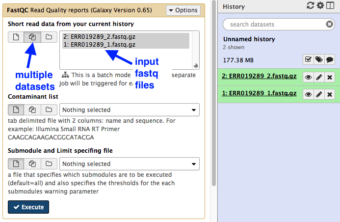
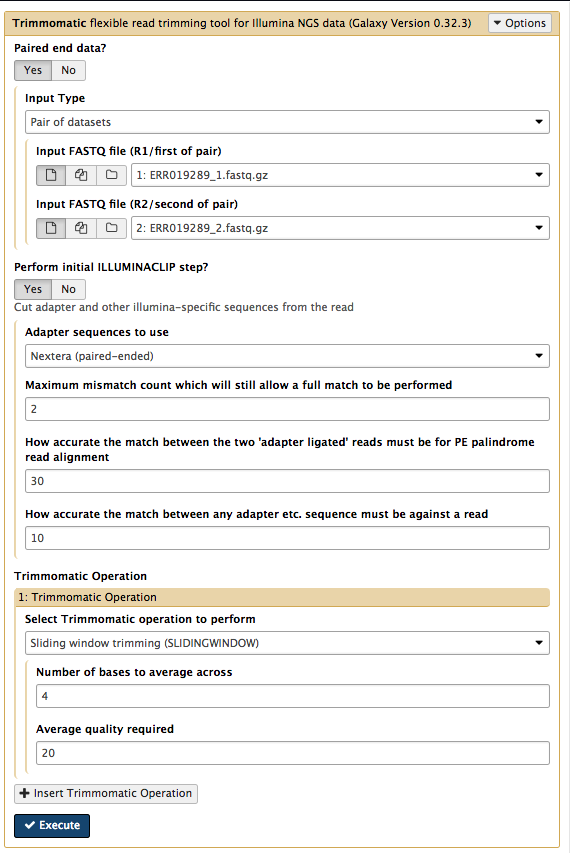
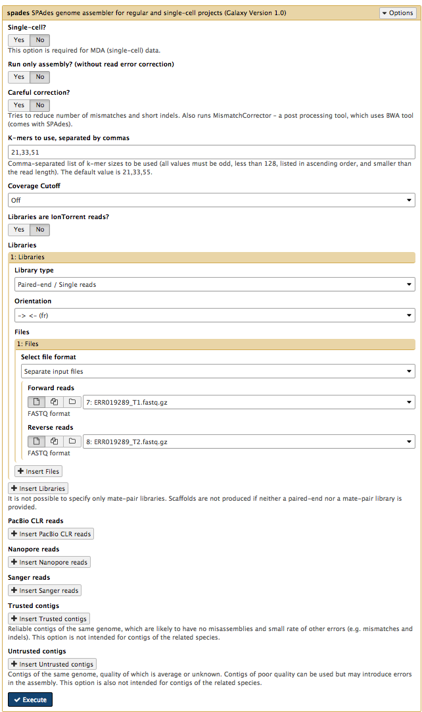
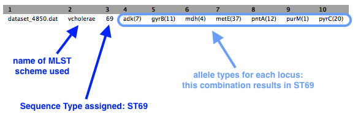

 
#Public data &rarr; assembly, annotation, MLST

##Overview

* Download a readset from a public database
* Check the quality of the data and filter
* Assemble the reads into a draft genome
* Annotate the genome
* Find the sequence type (the MLST)
* Find antibiotic resistance genes

##Background

Sequencing reads (readsets) for more than 100,000 isolates are available on public molecular sequence databases (GenBank/ENA/DDJB):

  - Most of these have been produced using the Illumina sequencing platform.
  - Most of these have no corresponding draft assembly.

Not all readsets are of high quality:

- There may be insufficient reads (usually ~x20 is the minimum read coverage needed).
- The reads could be from a mixed colony.
- The classification could be incorrect (both genus and species).

It is VERY important to check that what you find in the readset makes sense!

##Import data

- Go to your Galaxy instance.
- Set up a new History for this Activity.
    - In the History panel, click on the cog icon, select <ss>Create New</ss>.
    - A new empty history should appear; click on <fn>Unnamed history</fn> and re-name it (e.g. ENA Activity).

    

- Choose an accession number.
    - If you are working on this tutorial in a workshop: Assign yourself a readset from the table of isolates provided. Put your name in Column H. The accession number for the readset that relates to each isolate is located in Column A. ERR019289 will be used in this demonstration. <!-- <https://docs.google.com/spreadsheets/d/12X68SEXXcEY2EASjvvZe6w__60_1w3onqCIu1RZMYcg/edit#gid=0>. -->
    - Alternatively, use accession number ERR019289. This is *Vibrio cholerae*.

- In Galaxy, go to the Tools panel on the left, select <ss>Get Data &rarr; EBI SRA</ss>.
    - This causes the ENA website to open.
    - Enter the accession number in the ENA search bar.
    

- (The search may find reads under Experiment and Run. If so, click on the Accession number under "Run".)

- Find the column called <ss>Fastq files (galaxy)</ss>. Click on <fn>File 1</fn>.

This file will download to your Galaxy history, and will return you to the Galaxy page.

- Repeat the above steps for <ss>Get Data &rarr; EBI SRA</ss> and download <fn>File 2</fn>.

- The files should now be in your Galaxy history.
- Click on the pencil icon next to File 1.
    - Re-name it <fn>ERR019289_1.fastq.gz</fn>. <ss>Save</ss>
    - Change the datatype to **fastqsanger** (note: not fastqCsanger). <ss> Save</ss>
- Repeat for File 2 (name it <fn>ERR019289_2.fastq.gz</fn>).

##Evaluate quality

We will run FastQC on the pair of fastq files.

- In the Galaxy tools panel, go to <ss>NGS Analysis: NGS QC and manipulation: FastQC</ss>.
- Choose the <ss>Multiple datasets</ss> icon and then select both <fn>fastq</fn> files.
- Your Galaxy window should look like this:

- Click <ss>Execute</ss>  
- The output (4 files) will appear at the top of your Galaxy history.
- Click on the eye icon next to <fn>FastQC on data 1: Web page</fn>
- Scroll through the results. Take note of the maximum read length (e.g. 54).

##Trim

In this step we will remove adapters and trim low quality sequence from the reads.

- In the Galaxy tools panel, go to <ss>NGS Analysis: NGS QC and manipulation: Trimmomatic</ss>
- Leave settings as they are except for:
    - <ss>Input FASTQ file R1</ss> - check this is File 1
    - <ss>Input FASTQ file R2</ss> - check this is File 2
- Under <ss>Perform initial ILLUMINACLIP step</ss> choose *Yes*
    - Under <ss>Adapter sequences to use</ss> choose *Nextera(paired-ended)*
    - This trims particular adapters from the sequences.
- Under <ss>Trimmomatic Operation</ss> leave the settings as they are.
     - We will use the average quality across a 4 base sliding window to identify and delete bad sequence (and the flanking bases to the start or end of the sequences - whichever is nearest to the patch of poor quality sequence)

Your tool interface should look like this:

- Click <ss>Execute</ss>  

There are four output files.

  - Because trimmomatic might have trimmed some reads to zero, there are now some reads reads with no pair. These are in the *unpaired* output files. These can be deleted (with the cross button).
  - Re-name the other two output files, e.g. as <fn>ERRxxxxx_T1.fastq.gz</fn> & <fn>ERRxxxxx_T2.fastq.gz</fn>. These properly paired fastq files will be the input for the Spades assembly.  

## Assemble

We will assemble the trimmed reads.

In the left hand tools panel, go to NGS Analysis: NGS Assembly: spades

Leave the parameters as their defaults except:

- <ss>Careful correction?</ss> *No*
- <ss>Kmers to use, separated by commas:</ss> *21,33,51*
    - chosen kmers must be shorter than the read lengths (see the FastQC output: sequence length)
- <ss>Coverage Cutoff:</ss> *Off*
    - using a coverage cutoff might cause a problem if there are high copy number plasmids
- <ss>Forward reads:</ss> ERR019289_T1.fastq.gz
- <ss>Reverse reads:</ss> ERR019289_T2.fastq.gz

Your tool interface should look like this:

- Click <ss>Execute</ss>  

There are five output files.
- SPAdes contigs (fasta) & SPAdes scaffolds (fasta) - these should be identical with the conditions used here. Either file can be used as the draft genome sequence. Each multifasta file has an associated stats file that provides an overview of the sequence in the multifasta file (SPAdes contig stats & SPAdes scaffold stats).
- A summary of the assembly run is found in SPAdes log.

- Rename SPAdes contigs (fasta) to something like ERR019289.fasta
- Check the size of your draft genome sequence (view SPAdes contig stats)
   - Is it similar to other genomes of the same species?
   - Look at the table of genomes for your species at the NCBI website: Genome
<https://www.ncbi.nlm.nih.gov/genome/?term=>

## Find antibiotic resistance genes

Now that we have our assembled draft genome sequence, we can search it for particular genes.

We will use the tool called ABRicate <https://github.com/tseemann/abricate> to find antibiotic resistance genes in the genome. ABRicate uses a database of these genes called ResFinder https://cge.cbs.dtu.dk/services/ResFinder ; database https://cge.cbs.dtu.dk/services/data.php

In the tools panel, go to NGS Analysis: NGS Annotation: ABRicate

For <ss>Select fasta file</ss> choose <fn>SPAdes contigs (fasta)</fn> or whatever you renamed it (e.g. ERR019289.fasta).

Click <ss>Execute</ss>.

There is one output file. Click on the eye icon to view.

- A table with one line for each antibiotic resistance gene found.

## Find the sequence type (MLST)

Bacterial samples (isolates) are often assigned a "sequence type". This is a number that defines the particular combination of alleles for several genes, e.g. ST248.

Because several genes (loci) are used, this is termed Multi-Locus Sequence Typing (MLST).

There are different MLST schemes for different groups of bacteria.

In the tools panel, go to NGS Analysis: NGS Annotation: MLST

Under <ss>input_file</ss> choose choose <fn>SPAdes contigs (fasta)</fn> or whatever you renamed it (e.g. ERR019289.fasta).

Note: a specific MLST scheme can be specified if you wish, but by default all schemes are searched

Click <ss>Execute</ss>.

There is one output file. Click on the eye icon to view.

There is a one line output.

Some symbols are used to describe missing or inexact matches to alleles:

- n: Exact intact allele
- ~n : Novel allele similar to n
- n,m : Multiple alleles
- \- : Allele missing

## Annotate

We have found a list of resistance genes in the draft sequence, but we can also annotate the genome to find all the genes present.

In the tools panel, go to <ss>Tools &rarr; NGS Analysis &rarr; NGS: Annotation &rarr; Prokka</ss>  

Set the following parameters (leave everything else unchanged):

- <ss>Contigs to annotate</ss>: <fn>SPAdes contigs (fasta)</fn> (or equivalent)
- <ss>Locus tag prefix (--locustag)</ss>: P
- <ss>Force GenBank/ENA/DDJB compliance (--compliant)</ss>: *No*
- <ss>Sequencing Centre ID (--centre)</ss>: V
- Click <ss>Execute</ss>  

There are several output files:

gff-This is the master annotation in GFF format, containing both sequences and annotations

gbk-This is a standard GenBank file derived from the master .gff . If the input to prokka was a multi-FASTA, then this will be a multi-GenBank, with one record for each sequence

fna-Nucleotide FASTA file of the input contig sequences

faa-Protein FASTA file of the translated CDS sequences

ffn-Nucleotide FASTA file of all the annotated sequences, not just CDS

sqn-An ASN1 format "Sequin" file for submission to GenBank. It needs to be edited to set the correct taxonomy, authors, related publication, etc.

fsa-Nucleotide FASTA file of the input contig sequences, used by "tbl2asn" to create the .sqn file. It is mostly the same as the .fna file, but with extra Sequin tags in the sequence description lines

tbl-Feature Table file, used by "tbl2asn" to create the .sqn file

err-Unacceptable annotations - the NCBI discrepancy report

log-Contains all the output that Prokka produced during its run

txt-Statistics relating to the annotated features found

Tabulate

Collect information about each readset and assembly and add the information to your row in the isolate isolate table (link)

View

Can view the gff3 file in Artemis.
