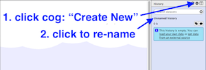
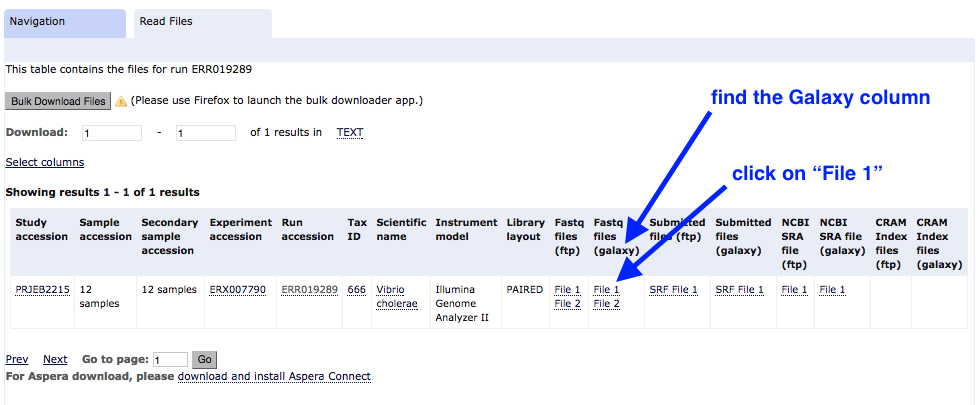

#Accessing public data to assemble and annotate a genome

##Overview

* Download a readset from a public database
* Check the quality of the data and filter
* Assemble the reads into a draft genome
* Annotate the genome
* Find the sequence type (MLST)
* Find antibiotic resistance genes

##Background

Sequencing reads (readsets) for more than 100,000 isolates are available on the public molecular sequence databases (GenBank/ENA/DDJB).

  - Most of these have been produced using the Illumina sequencing platform.
  - Most of these have no corresponding draft assembly.

Not all readsets are of high quality.

- There may be insufficient reads (usually ~x20 is the minimum read coverage needed).
- The reads could be from a mixed colony.
- The classification could be incorrect (both genus and species).

It is VERY important to check that what you find in the readset makes sense!

##Import data

- Go to your Galaxy instance.
- Set up a new History for this Activity.
    - In the History panel, click on the cog icon, select <ss>Create New</ss>.
    - A new empty history should appear; click on <fn>Unnamed history</fn> and re-name it (e.g. ENA Activity).

    

- Choose an accession number.
    - If you are working on this tutorial in a workshop: Assign yourself a readset from the table of isolates provided. Put your name in Column H. The accession number for the readset that relates to each isolate is located in Column A. ERR019289 will be used in this demonstration. <!-- <https://docs.google.com/spreadsheets/d/12X68SEXXcEY2EASjvvZe6w__60_1w3onqCIu1RZMYcg/edit#gid=0>. -->
    - Alternatively, use accession number ERR019289. This is *Vibrio cholerae*.

- In Galaxy, go to the Tools panel on the left, select <ss>Get Data &rarr; EBI SRA</ss>.
    - This causes the ENA website to open.
    - Enter the accession number in the ENA search bar.
    

- (The search may find reads under Experiment and Run. If so, click on the Accession number under "Run".)

- Find the column called <ss>Fastq files (galaxy)</ss>. Click on <fn>File 1</fn>.

This file will download to your Galaxy history, and will return you to the Galaxy page.

- Repeat the above steps for <ss>Get Data &rarr; EBI SRA</ss> and download <fn>File 2</fn>.

- The files should now be in your Galaxy history.
- Click on the pencil icon next to File 1.
    - Re-name it <fn>ERR019289_1.fastq.gz</fn>. <ss>Save</ss>
    - Change the datatype to **fastqsanger** (note: not fastqCsanger). <ss> Save</ss>
- Repeat for File 2 (name it <fn>ERR019289_2.fastq.gz</fn>).

##Evaluate quality

We will run FastQC on the pair of fastq files.

- In the Galaxy tools panel, go to <ss>NGS Analysis: NGS QC and manipulation: FastQC</ss>.
- Choose the <ss>Multiple datasets</ss> icon and then select both <fn>fastq</fn> files.
- Your Galaxy window should look like this:

- Click <ss>Execute</ss>  
- The output (4 files) will appear at the top of your Galaxy history.
- Click on the eye icon next to <fn>FastQC on data 1: Web page</fn>
- Scroll through the results. Take note of the maximum read length.

##Trim

In this step we will remove adapters and trim low quality sequence from the reads.

- In the Galaxy tools panel, go to <ss>NGS Analysis: NGS QC and manipulation: Trimmomatic</ss>
- Leave settings as they are except for:
    - <ss>Input FASTQ file R1</ss> - check this is File 1
    - <ss>Input FASTQ file R2</ss> - check this is File 2
- Under <ss>Perform initial ILLUMINACLIP step</ss> choose *Yes*
    - Under <ss>Adapter sequences to use</ss> choose *Nextera(paired-ended)*
    - This trims particular adapters from the sequences.
- Under <ss>Trimmomatic Operation</ss> leave the settings as they are.
     - We will use the average quality across a 4 base sliding window to identify and delete bad sequence (and the flanking bases to the start or end of the sequences - whichever is nearest to the patch of poor quality sequence)

Your tool interface should look like this:

- Click <ss>Execute</ss>  

- There are four output files.
  - Because trimmomatic might have trimmed some reads to zero, there are now some reads reads with no pair. These are in the *unpaired* output files. These can be deleted (with the cross button).
  - Re-name the other two output files, e.g. as <fn>ERRxxxxx_T1.fastq.gz</fn> & <fn>ERRxxxxx_T2.fastq.gz</fn>. These properly paired fastq files will be the input for the SPAdes assembly.  

## Assemble the reads

using Spades - pick the K-mers to use based on the read set - 21,33,51 -k-mer can’t exceed the read length (look at the FastQC output!!!)
Don’t use a coverage cutoff - might cause a problem if there are high copy number plasmids
Section 2: Assembly and Analysis
Assembly
Run SPAdes on the properly paired fastq files generated by Trimmomatic
 Example input: ERR019289_T1.fastq.gz & ERR019289_T2.fastq.gz
 NGS: Assembly>spades
Output: Two multifasta files (SPAdes contigs (fasta) & SPAdes scaffolds (fasta)) - these should be identical with the conditions used here. Either file can be used as the draft genome sequence. Each multifasta file has an associated stats file that provides an overview of the sequence in the multifasta file (SPAdes contig stats & SPAdes scaffold stats). A summary of the assembly run is found in SPAdes log.

Set the following parameters:
Single-cell?: No
Run only Assembly: No
Careful correction?: No
Kmers to use, separated by commas: 21,33,51
**Choose based on Readset - length of reads **
Coverage Cutoff: off
Forward reads: ERR019289_T1.fastq.gz
Reverse reads: ERR019289_T2.fastq.gz

Your tool interface should look like this:

Click Execute
Rename SPAdes contigs (fasta) to something that like ERR019289.fasta
   Check the size of your draft genome sequence  (view SPAdes contig stats)
   Is it similar to other genomes of the same species?
   Look at the table of genomes for your species at the NCBI website: Genome

Check Assembly and Tabulate
Collect information about each readset and assembly and add the information to your row in the isolate isolate table (link)
