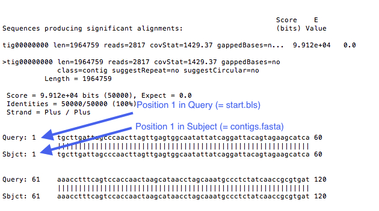
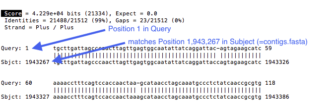

#PacBio reads: assembly with command line tools

This tutorial demonstrates how to use long sequence reads to assemble a bacterial genome.

## Learning objectives

At the end of this tutorial, be able to use command line tools to:

1. assemble long (PacBio) sequence reads
2. trim overhang
3. correct the draft assembly with short (Illumina) reads
4. circularise the corrected assembly.

=> finished assembly

##Input files

- Open the mGVL command line
- Navigate to the directory in which you want to work.

You will also need to know the location of the sequences (the file path).

TBA: filepath of staph tutorial data. e.g. sample 25745 -- Staphylococcus aureus.

- pacbio files (3 x fastq.gz)
- illumina reads (2 x fastq.gz)

Make sure these files are in the directory.


PacBio files are often stored in the format:

Sample_name/Cell_name/Analysis_Results/long_file_name_1.fastq

The PacBio sequences are usually stored in three fastq files.

Illumina files will be in forward and reverse reads, R1 and R2.

## join pacbio fastq files

This command takes the three FASTQ files, pipes them to gzip, and stores the gzipped concatenated sequences in the file subreads.fastq.gz

Type in:

```Unix
cat filepath/filep0.*.subreads.fastq | gzip > subreads.fastq.gz
```

if the files are already gzipped,

```Unix
cat filepath/filep0.*.subreads.fastq.gz > subreads.fastq.gz
```

##Assemble with Canu

Type in:

```Unix
canu -p staph -d outdir corMhapSensitivity=high corMinCoverage=0 genomeSize=2.8m -pacbio-raw subreads.fastq.gz
```

- **staph** is the prefix given to output files (check)
- **outdir** is the output directory
- **corMhapSensitivity** and **corMinCoverage** is a recommended option for (to be explained)
- **genomeSize** only has to be approximate

e.g.
Staph: 2.8m

note: it may say "Finished..."  but it is probably still running
type squeue to see what is running


Canu will correct, trim and assemble the reads.
This will take ~ x minutes.

**Check output**

Look at the outdir.

- contigs.fasta : assembled sequences
- unassembled.fasta
- file.gfa : the graph of the assembly (could examine in Bandage).

**Look at the contigs file**


```Unix
fa -f contigs.fasta
```

if there are two contigs, split them:

index the contigs file:
samtools faidx staph.contigs.fasta

send each contig to a new file:

samtools faidx staph.contigs.fasta tig00000000 > contig1.fa

samtools faidx staph.contigs.fasta tig00000001 > contig2.fa

**What is in the unassembled reads**

- are they contaminants? blast against ncbi?
(explain how to do so on command line)


output => assembled contigs

## Trim overhang
The assembly graph will be split at an ambiguous/unstable node. However, this area of the graph likely overlaps in the bacterial chromosome, but has not aligned with itself completely. This is called an overhang.

To find out whether the ends match, blast the first bit of the assembly with the last bit. e.g. the first 60kb.


Find where these should properly overlap, and trim. (explain how)

- take the first 501 lines (there are 100 bases per line) and send them to a new file => 50,000 bases
- this is the start of the assembly. want to see if it matches the end (overhang)

(note: do this for the largest contig. if additional smaller contigs, take fewer start lines)


```Unix
head -n 501 ass.contigs.fasta > start.fasta
```

- format the assembly file for blast
```Unix
formatdb -i ass.contigs.fasta -p F
```

- blast the start (the 50k bases in the file called start.fasta) against the whole assembly (the contigs.fasta), send to file called start.bls

```Unix
blastall -p blastn -i start.fasta -d ass.contigs.fasta -e 1e-100 -F F -o start.bls
```

- look at start.bls to see hits


```Unix
less start.bls
```


Then type

```Unix
/ Score
n
```

this takes you to the first blast match

then

```Unix
n
```

to see the next blast match




- This position, near the end of the contig, is where the overhang starts.

(type "n" again to check there are no more matches)

- also check that this match goes to the end of the contig.

- use the position at the start of the overhang; trim

first, index the fasta file

```Unix
samtools faidx contigs.fasta
```

makes contigs.fasta.fai
(samtools will find this automatically though in the next step)


```Unix
samtools faidx contigs.fasta tig00000000:1-943266 > trimmed.fa
```

- open the trimmed.fa file

```Unix
nano trimmed.fa
```

delete the header info except contig name (e.g. tig00000000)
exit.

output => trimmed contigs


make single FASTA file
chromosome
plasmid


##Correct with Pilon

canu doesn't do any polishing, so there will be thousands of errors, almost all insertions.
input: draft pacbio assembly (overhang trimmed) and illumina reads (in bam format)
output: corrected assembly


**Align Illumina reads => bam**

Illumina reads are shorter but have fewer errors (and/or there are just more of them? so consensus is more accurate)

These can be aligned to the PacBio assembly to correct any errors.

- trimmed contigs + Illumina R1 & R2 => align with BWA-MEM => hybrid contigs => samtools sort => bam
- samtools index bam

```Unix
bwa index contigs.fasta
bwa mem -t 8 contigs.fasta r1s r2s | samtools sort > aln.bam
samtools index aln.bam
samtools faidx contigs.fasta
```

-t is the number of cores (e.g. 8)
to find out how many you have,
grep -c processor /proc/cpuinfo

**Correct**

contigs & bam => pilon => corrected contigs

pilon

--genome contigs.fasta
--frags aln.bam [that we just created]
--prefix corrected
--changes
--threads 72
--verbose
[does have some options for mindepth - can change these if we want]
--minmq 60  [min mapping aln quality - default 0 is silly- bwa-mem uses 60, bowtie uses 42; 60 should remove most multi mapping stuff]

don't run on things with lots (10+) of contigs, but 1 or 2 is ok

```bash
pilon --genome contigs.fasta --frags aln.bam --output corrected --changes --threads 8 --verbose --minmq 60
```

output:
lots of files. look at .pilon.fasta
so cf to input file, this one could be longer
can look at the changes file

less corrected.changes


a lot are single, but there are some bigger ones.

=> corrected assembly


(Correct again?)

##Circularise
corrected contigs => circlator => circular genome starting at dnaA

```Unix
circlator fixstart trimmed.fa outprefix
```


orients at DNAa

=> circular, corrected assembly


for plasmid:
circlator fixstart --genes_fa filename contig outprefix

need to give it the file (DNA?) of repA
need to download


## Next

Annotate - in Galaxy, obtain this file

## Links

[Canu manual](http://canu.readthedocs.io/en/stable/quick-start.html)

[Canu code](https://github.com/marbl/canu)

[Pilon article](http://journals.plos.org/plosone/article?id=10.1371/journal.pone.0112963)

[Pilon on github](https://github.com/broadinstitute/pilon/wiki)

Circlator
http://genomebiology.biomedcentral.com/articles/10.1186/s13059-015-0849-0
http://sanger-pathogens.github.io/circlator/

Finishing

https://github.com/PacificBiosciences/Bioinformatics-Training/wiki/Finishing-Bacterial-Genomes

https://github.com/PacificBiosciences/Bioinformatics-Training/wiki/Evaluating-Assemblies

Files

reference to bas.h5 files (details) https://s3.amazonaws.com/files.pacb.com/software/instrument/2.0.0/bas.h5+Reference+Guide.pdf
