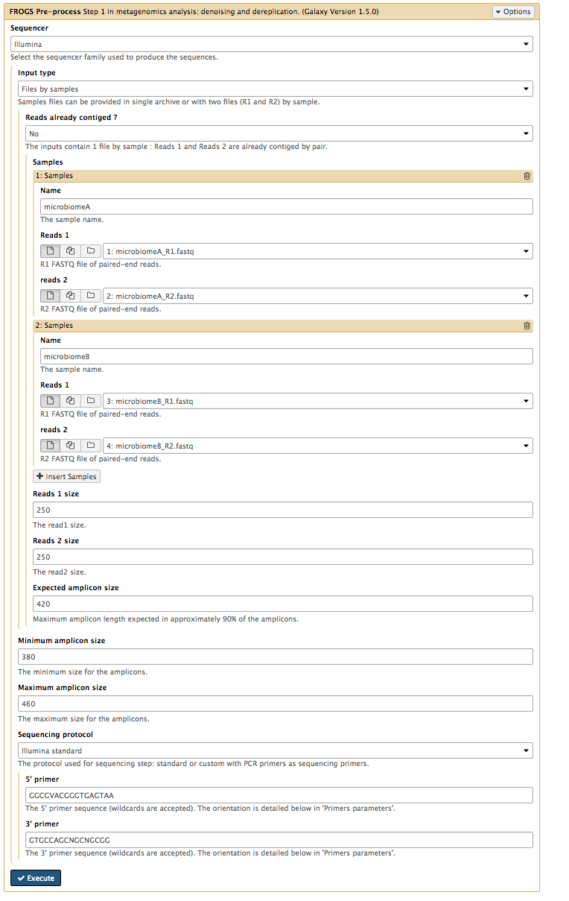
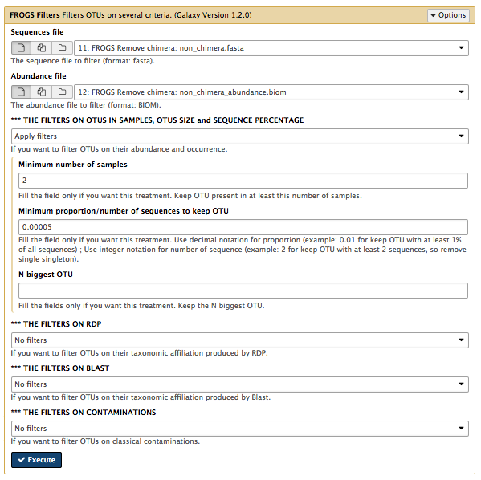

 
#Metagenomics
- aim: to find taxa and/or genes(infer functions) in sample/s
- uses environmental samples (not cultured)
- uses 16S rRNA if classifying bacteria in sample
- uses WGS if trying to use DNA to identify the functions of genes (and to see what pathways are happening)
- compare microbial communities from different environments: do this by comparing the metagenome: e.g. GC-content, k-mers, size, how many spp, functions of genes
- eg for function, can compare to a database (COG or KEGG) and see whether metagenomes differ (statistically test) -
- More about 16S rRNA: The 16S sequence is RNA that makes up part of the bacterial ribosome (together with other rRNA and protein). The operon is 16S, 23S, 5S - and there may be many copies of the operon (7 in E coli).

## Overview of FROGS

- Tool: FROGS (in Galaxy) - Find Rapidly OTU with Galaxy Solution
- uses a different way of clustering similar sequences into OTUs.

##Get data

- The data: paired-end Illumina reads from ?two ?environmental samples
- Data location: ...<https://drive.google.com/open?id=0B-DKulJTTftlT2djQmJ4aTN6Q1U>
(or put in public.html folder or swift)
- Upload tar.gz or unzip first?

- Note: change file type to fastqsanger for each of the input reads

- In Galaxy:
  - how to upload the files into current history

- In the Galaxy tools panel, in the top search bar, type FROGS.
- This will bring up the various tools available.
- We will be using 6 of these tools.

##1. Pre-process

What it does:

- if data is not contiged, will overlap read1 and read2 (allows some mismatch in overlapping region)
- filters out contigs that are too big or small
- if using illumina standard protocol: looks for those primers (primers provided?) - filters out contigs without primers. cuts primer seqs.
- filter out seqs that are too small or poor qual.
- de-replication - remove duplicates but keep a copy of the number of counts for each duplicate

Input: R1 and R2 reads (multiple samples).

- <ss>Sequencer</ss> - Illumina
- <ss>Input type</ss> - Files by samples
- <ss>Reads alread contiged?</ss> - No
- <ss>Samples</ss> - Name - sample1 --note no spaces
- <ss>Reads1</ss> - <fn>01R1.fq</fn>
- <ss>Reads2</ss> - <fn>01R2.fq</fn>
- <ss>Insert Samples</ss>- click plus sign
- <ss>Samples</ss> - Name - sample2 --note no spaces
- <ss>Reads1</ss> - <fn>02R1.fq</fn>
- <ss>Reads2</ss> - <fn>02R2.fq</fn>
- <ss>Reads 1 size</ss> - 250
- <ss>Reads 2 size</ss> - 250
- <ss>Expected amplicon size</ss> - 420
- <ss>Minimum amplicon size</ss> - 380
- <ss>Maximum amplicon size</ss> - 460
- <ss>Sequencing protocol</ss> - Illumina standard
- <ss>5' primer</ss> - GGCGVACGGGTGAGTAA
- <ss>3' primer</ss> - GTGCCAGCNGCNGCGG //note needs to be in 5' to 3' orientation
- <ss>Execute</ss>

Output: 3 files
<fn>deprelicated.fasta</fn>
<fn>count.tsv</fn>
<fn>report.html</fn>

1. <fn>report.html</fn>

- shows how samples were filtered. eg. the number of reads kept at each filtering stage.
- (what would be a problem to see here? lots of reads removed at a particular filtering stage?) -- e.g. if many (>20%) are lost at the overlapping stage the data could be poor quality.
- so any of these bars low compared to first bar is bad

compare display amplicon lengths before and after

also:
eg one sample might be bad compared to other samples

2. <fn>counts.tsv</fn>

- number of (the same seq) in sample 1 and sample 2

3. <fn>dereplicated.fasta</fn>
this is the sequences (just one copy if there are dups)

##2. Clustering swarm

Sequences are clustered into groups using Swarm.

Input: the fasta and counts file from pre-processing.

What it does:
Sorts reads by abundance.
Clusters the reads into pre-clusters using Swarm and distance parameter of 1.
Sorts these pre-clusters by abundance.
Cluster the pre-clusters using Swarm and a user-specified distance.

settings:

- <ss>Sequences files</ss>: dereplicated_file from step 1
- <ss>Counts file</ss>: counts file from step 1
- <ss>Aggregation distance</ss>: 3
- <ss>Perform deionising clustering step?</ss>: Yes
- <ss>Execute</ss>

Outputs:

- abundance <fn>file</fn> in biom format
- <fn>seed_sequences.fasta</fn> - the cluster (OTU) representative sequence
- <fn>swarms.composition.tsv</fn> - what is in each cluster.

##3. Remove chimera

Closely-related sequences may form chimeras (mixed sequences) during PCR (libray prep). This step removes these sequences.

How it works:
splits input data into samples
uses vsearch to find chimeras in each sample
removes these

- <ss>Sequences file</ss>: <fn>seed_sequences.fasta</fn>
- <ss>Abundance type</ss>: <fn>BIOM file</fn>
- <ss>Abundance file</ss>: <fn>abundance.biom</fn>
- <ss>Execute</ss>

Outputs:

A filtered file containing no chimeras non_chimera.fasta
A filtered abundance file containing no chimeras non_chimera.biom
Summary  report.html

seems to be a lot removed? - yes a lot of clusters were removed but still 70% of actual reads.

##4. Filters

The OTUs have now been clustered.
In this step, we will filter out some of the OTUs. (? we have set 2 samples per OTU - i.e. OTU must be in both sample? OTU must contain at least 0.005 percent of all the seqs?)

- <ss>Sequences file</ss>: <fn>non_chimera.fasta</fn>
- <ss>Abundance file</ss>:  <fn>non_chimera_abundance.biom</fn>
- <ss>*** THE FILTERS ON OTUS IN SAMPLES, OTUS SIZE and SEQUENCE PERCENTAGE</ss>: Apply filters
- <ss>Minimum number of samples</ss>: 2
- <ss>Minimum proportion/number of sequences to keep OTU</ss>: 0.00005
- <ss>N biggest OTU</ss>: leave blank
- <ss>*** THE FILTERS ON RDP</ss>: No filters
- <ss>*** THE FILTERS ON BLAST</ss>: No filters
- <ss>*** THE FILTERS ON CONTAMINATIONS</ss>: No filters
- <ss>Execute</ss>

]

Outputs:
a filtered abundance and fasta file
an excluded.txt
a report.html

only kept %20 of OTUs?
this is ok
kept most of the sequences (the abundance pie)

We should do 3+ samples
Then could click on Venn diagram here and see intersection.

##5. Affliations OTU
OTUs- Operation Taxonomic Unit
- this is a cluster of sequences.
- this step adds the taxonomy to the abundance file. (why?)
- uses the SILVA database for rRNA- that has been filtered for only (16S or all 30S?), non-redundant, keeping certain taxonomic levels, and split into pro and eukaryotes.
- this step uses blastn+ to align each OTU against seqs in the dbase, keeping the best.
- It can return multi-affiliation - see notes below tool panel.

- <ss>Using reference database</ss>: silva123
- <ss>Also perform RDP assignation</ss>: No
- <ss>OTU seed sequence</ss>: output.fasta from step 4
- <ss>Abundance file</ss>: output.biom from step 4
- <ss>Execute</ss>

Outputs:
abundance file with affiliation   <fn>affiliation.biom</fn> - note this biom file is not human-readable. You can convert it with the frogs biom to tsv tool.

report.html

##6. Affiliations stat
- Computes some statistics
- generates a report of the OTUs/taxonomy found

- <ss>Abundance file</ss>: <fn>affiliation.biom</fn>from step 5
- <ss>Rarefaction ranks</ss>: Class Order Family Genus Species
- <ss>Affiliation processed</ss>: FROGS blast
- <ss>Execute</ss>

Outputs:
<fn>summary.html</fn>

- click on Display global distribution - this is the pooled info

- Pie chart thing - how to read - start in the centre. major groups each have a segment by colour. then more detail as you go outwards.
- click cross to exit

- tick the boxes next to the samples - or one at a time
- then with selection order - click Display rarefaction
- Rarefaction curve - what does it mean - x axis is diversity (eg number of classes). y axes is how many samples processes. So it shows how many samples you need to process before you are covering the diversity. ie whether you have adequately covered the diversity.
- or click Display Distribution

##Links
- FROGS slides by Yvan Le Bras <https://f1000research.com/slides/5-1832>
- The SILVA database: <https://www.arb-silva.de/>
- Other metagenomics software:
    - QIIME: <http://qiime.org/>    
    - UPARSE: <http://www.drive5.com/uparse/>
    - MOTHUR: <https://www.mothur.org/>
    - MG-RAST: <http://metagenomics.anl.gov/>
