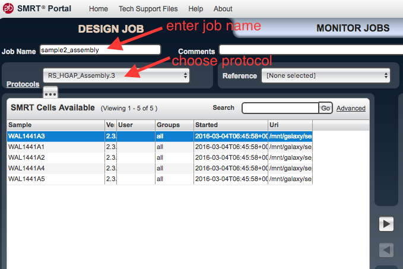
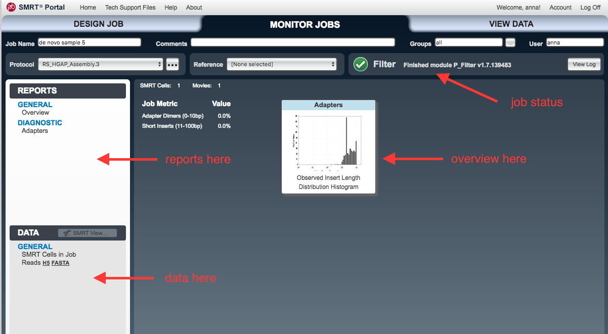

#Assembly with PacBio data and SMRT Portal

This tutorial will show you how to assemble a bacterial genome *de novo*, using the PacBio SMRT Portal on the mGVL. We will use an analysis pipeline called HGAP, the Hierarchical Genome Assembly Process.

<!-- FIXMEs:

- will SMRT portal be available on all training GVLs
- will students use existing SMRT portal registrations, or will each set up their own
- PacBio data E coli to be loaded into SMRT portal(s) -->

## Start
- Open your mGVL dashboard.
- You should see SMRT Portal as one of the instance services on your GVL dashboard.
- Open up the SMRT portal web link (to the right) and register/log on.

## Input
We will use a publicly available data-set of PacBio reads from the bacteria *E. coli* (reference link below).

If this has already been loaded onto SMRT portal (e.g. for use during a workshop), proceed to the next step ("Assembly").

Otherwise:

- Load the PacBio data (your own, or the training *E. coli* dataset) onto your GVL.
- In the SMRT Portal, go to <ss>Design Job</ss>, the top left tab.
- Go to <ss>Import and Manage</ss>.

- Click <ss>Import SMRT cells</ss>.

- Work out where you put the data on your GVL, and make sure the file path is showing.
    - If not, click <ss>Add</ss> and enter the file path to the data.
- Click on the file path and then <ss>Scan</ss> to check for new data.

## Assembly
- In the SMRT Portal, go to the top left tab, <ss>Design Job</ss>.
- Go to <ss>Create New</ss>.
- An <ss>Analysis</ss> window should appear. Check the box next to <ss>De novo assembly</ss>, then <ss>Next</ss>.
- Under <ss>Job Name</ss> enter a name.
- Under <ss>Protocols</ss> choose <ss>RS_HGAP_Assembly.3</ss>.
- There is an ellipsis underneath <ss>Protocols</ss> - click on the ellipsis.

This brings up the settings. Click on <ss>Assembly</ss>.

- For <ss>Compute Minimum Seed Read Length</ss>: ensure box is ticked
- For <ss>Number of Seed Read Chunks</ss>: enter *12*
- Change the <ss>Genome Size</ss> to an approximately correct size for the species. For *E. coli*, enter 4600000.
- For <ss>Target Coverage</ss>: enter *10*
- For <ss>Overlapper Error Rate</ss>: enter *0.04*
- Leave all other settings as they are.
- Click <ss>Apply</ss>

 Your protocol window should look like this:

- Click <ss>Ok</ss>.  

- In the <ss>SMRT Cells Available</ss> window, select the file to be used. Click on the arrow to transfer these files to the SMRT Cells in Job window.

- Click <ss>Save</ss> (bottom right hand side).
- Next to <ss>Save</ss>, click <ss>Start</ss>.
- The <ss>Monitor Jobs</ss> window should open.
    - As each step proceeds, new items will appear under the <ss>Reports</ss> and <ss>Data</ss> tabs on the left.

## Output

Click on the top right tab, <ss>View Data</ss>.

- Double click on the job name to open its reports.
- Click on different <ss>Reports</ss> in the left hand panel.

[add screenshot for reports overview]

Things to look at:

**General: Filtering (polymerase reads)**

- number of reads post-filter
- read length (=average)

**General: Subread Filtering (subreads)**

- number of reads post-filter
- read length (average)

**Assembly: Pre-Assembly (pre-assembled reads)**

- length cutoff (the computed minimum seed read length)
- read length (average)

**Assembly: Corrections**

Consensus calling results:

- Consensus concordance should be > 99%.

Graph: corrections across reference:

- With the first run of polishing, expect a lot of corrections but they should be randomly distributed.

**Assembly: Top Corrections**

This is a list of all the corrections made.

- If more than two corrections (with confidence > 50), repeat polishing (see next section "Further polishing").

**Resequencing: Coverage**

Coverage across reference:

- discard contigs <20X coverage
- others should have fairly consistent coverage.
- spikes could be collapsed repeats.
- valleys could be mis-assembly - e.g. draft assembly was incorrect and so remapped reads didn't support this part of the assembly.

Graph: Depth of Coverage:

*Number* of reference regions vs coverage. Should be roughly normal?

**Assembly: Polished Assembly**

- number of contigs
- max contig length
- graph: confidence vs depth. multi-copy plasmids may have higher coverage.

## Further Polishing

During polishing, raw reads are used to correct the assembly.
During HGAP, the assembly was polished once but may need further corrections.

- From the previous step, Go to <ss>Data &rarr; Assembly &rarr; Polished Assembly</ss> and download the FASTA file by clicking on it.
    - Unzip the .gz file
- Go to <ss>Design Job &rarr; Import and Manage</ss> and click <ss>New</ss> on the bottom right hand side. Then, select that FASTA assembly file to upload.
    - creates a new reference.
- Go to <ss>Design Job &rarr; Create New</ss>
    - choose reference-based
    - Select protocol: RS_Resequencing.1
    - Leave all settings.
    - Select your reference from the drop down menu.
    - Click <ss>Save</ss> and <ss>Start</ss>.
- Examine the output assembly and repeat if necessary (e.g. if > 2 corrections with >50 confidence).

##Output

Polished Assembly FASTA file

=> download to local computer; or

=> open file in (GVL) Galaxy (TBA); or

=> open file in GVL command line: and further analysis.

##Next

Further options:

- correct with Illumina reads
- circularise
- annotate

## Links to more information

[PacBio *E. coli* data set](https://github.com/PacificBiosciences/DevNet/wiki/E.-coli-Bacterial-Assembly)

[HGAP overview](https://github.com/PacificBiosciences/Bioinformatics-Training/wiki/HGAP)

[A full ist of reports and terminology](http://files.pacb.com/software/smrtanalysis/2.3.0/doc/smrtportal/help/Webhelp/SMRT_Portal.htm)

[Video overview of HGAP on SMRT portal](http://www.pacb.com/training/BacterialAssemblyandEpigeneticAnalysis/story.html)

[More about the SMRT bell template](http://files.pacb.com/Training/IntroductiontoSMRTbellTemplatePreparation/story_content/external_files/Introduction%20to%20SMRTbell%E2%84%A2%20Template%20Preparation.pdf)
