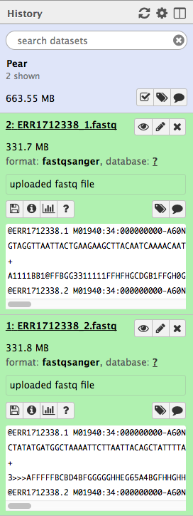
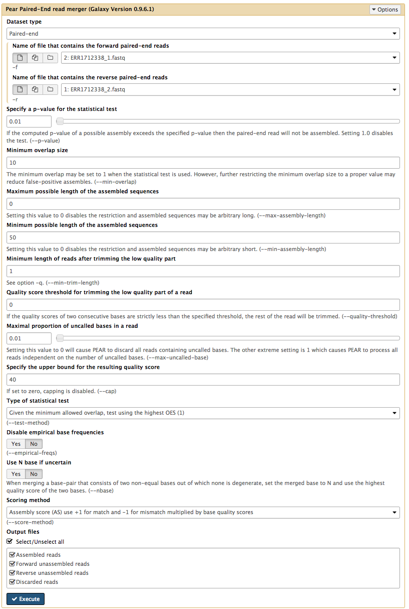

# Pear

[Pear](https://academic.oup.com/bioinformatics/article-lookup/doi/10.1093/bioinformatics/btt593) is a tool to merge paired-end sequencing reads, prior to downstream tasks such as assembly.

## Get data

Input: paired-end reads.

- We will use a set of Illumina MiSeq reads from the bacteria *Staphylococcus aureus*.

Go to your Galaxy server.

- In the tool panel, go to <ss>Get Data: Upload File</ss>
- Select <ss>Paste/Fetch data</ss>
- In the box, paste in:

<fn>ftp://ftp.sra.ebi.ac.uk/vol1/fastq/ERR171/008/ERR1712338/ERR1712338_2.fastq.gz</fn>
<fn>ftp://ftp.sra.ebi.ac.uk/vol1/fastq/ERR171/008/ERR1712338/ERR1712338_1.fastq.gz</fn>

- Click <ss>Start</ss> and then <ss>Close</ss>.
- These two files will upload to your current Galaxy history.
- Using the pencil icon, change the filetype to "fastqsanger", and shorten the name of the file.

## Run Pear

In the tool panel, go to <ss>NGS Analysis: NGS QC and manipulation: Pear</ss>

- <ss>Dataset type</ss>: *Paired-end*
- <ss>Name of file that contains the forward paired-end reads</ss>: <fn>ERR1712338_1.fastq</fn>
- <ss>Name of file that contains the reverse paired-end reads</ss>: <fn>ERR1712338_2.fastq</fn>
- Leave other settings as per defaults, except:
- <ss>Maximal proportion of uncalled bases in a read</ss>: *0.01*
    - omits reads if >1% of the reads is missing (N)
- <ss>Output files</ss>: *Select all*

Your tool interface should look like this:

- Click <ss>Execute</ss>

## Results

There are four output files.

- <fn>Assembled reads</fn>: merged paired-end reads.
- <fn>Unassembled forward reads</fn> and <fn>Unassembled reverse reads</fn>: remaining, unmerged reads.
- <fn>Discarded reads</fn>: Did not meet quality specified

In this case, most of the reads have been merged (~360MB); 90MB are unmerged, and 350 sequences have been discarded.

## Next

Run Trimmomatic to trim sequences before assembling.

## Links

[Pear paper](https://academic.oup.com/bioinformatics/article-lookup/doi/10.1093/bioinformatics/btt593)

[Pear software](https://sco.h-its.org/exelixis/web/software/pear/)
