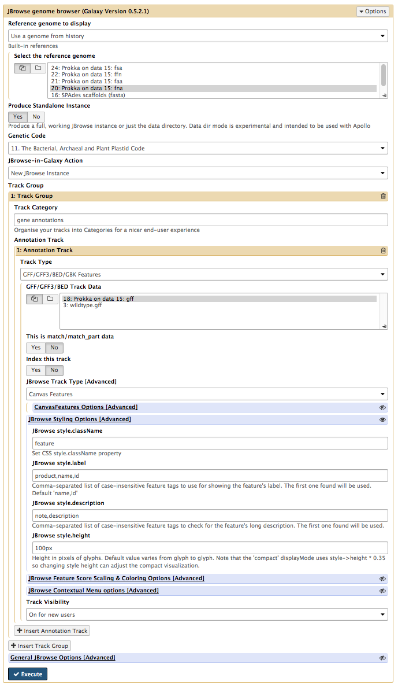
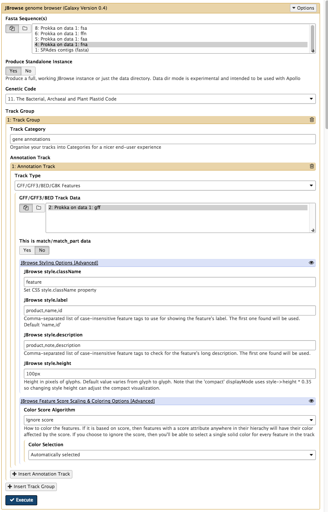
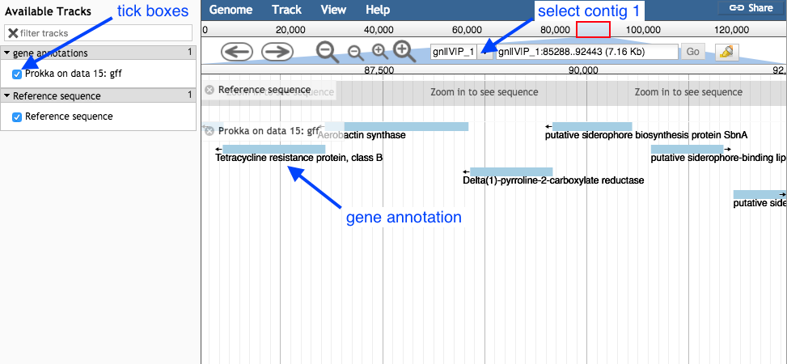
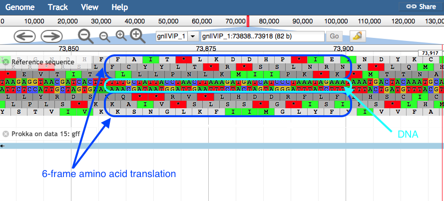

 
# Genome annotation using Prokka

Keywords: annotation, Prokka, JBrowse, Galaxy, Microbial Genomics Virtual Lab

## Background

In this section we will use a software tool called Prokka to annotate the draft genome sequence produced in the previous [tutorial](/modules/spades/index.md). Prokka is a “wrapper”; it collects together several pieces of software (from various authors), and so avoids “re-inventing the wheel”.

Prokka finds and annotates features (both protein coding regions and RNA genes, i.e. tRNA, rRNA) present on on a sequence. Note, Prokka uses a two-step process for the annotation of protein coding regions: first, protein coding regions on the genome are identified using [Prodigal](http://prodigal.ornl.gov/); second, the *function* of the encoded protein is predicted by similarity to proteins in one of many protein or protein domain databases. Prokka is a software tool that can be used to annotate bacterial, archaeal and viral genomes quickly, generating standard output files in GenBank, EMBL and gff formats. More information about Prokka can be found [here](https://github.com/tseemann/prokka).

## Learning objectives

At the end of this tutorial you should be able to:

1. load a genome assembly into Prokka
2. annotate the assembly using Prokka
3. examine the annotated genome using JBrowse

## Input data

Prokka requires assembled contigs.

- If you are continuing on from the previous workshop ([Assembly with Spades](/modules/spades/index.md)), this file will be in your current history: <fn>SPAdes on data 2 and data1: contigs(fasta)</fn>. 

- Or, if you have uploaded the history of workshop files, there is also a copy in your history called <fn>SPAdes_contigs.fasta</fn>. Either copy is fine to use. 

- Alternatively, get the file called "assembled contigs" from the [Training dataset page.](../data-dna/index.md)

<!--
We will import a history from Galaxy:

- In the menu options across the top, go to <ss>Shared Data</ss>.
- Click on <ss>Histories</ss>.
- A list of published histories should appear. Click on <fn>GCC 2016 small genome annotation</fn>.
- Click on <ss>Import history</ss>.
- An option will appear to re-name the history. We don't need to rename it, so click <ss>Import</ss>.
- The history will now appear in your Current History pane, and the <fn>SPAdes_contigs.fasta</fn> file is now ready to use in Galaxy analyses.
-->

## Run Prokka

- In Galaxy, go to <ss>Tools &rarr; NGS Analysis &rarr; NGS: Annotation &rarr; Prokka</ss>  
- Set the following parameters (leave everything else unchanged):
    - <ss>Contigs to annotate</ss>: <fn>SPAdes contigs (fasta)</fn>  
    - <ss>Locus tag prefix (--locustag)</ss>: P
    - <ss>Force GenBank/ENA/DDJB compliance (--compliant)</ss>: *No*
    - <ss>Sequencing Centre ID (--centre)</ss>: V
    - <ss>Genus Name</ss>: *Staphylococcus*  
    - <ss>Species Name</ss>: *aureus*  
    - <ss>Use genus-specific BLAST database</ss> *No*  

Your tool interface should look like this:

- Click <ss>Execute</ss>  

## Examine the output

<!-- First, enable *Scratchbook* in Galaxy - this allows you to view several windows simultaneously. Click on the 3&times;3 squares icon on the menu bar:

-->

Once Prokka has finished, examine each of its output files.

- The <fn>GFF</fn> and <fn>GBK</fn> files contain all of the information about the features annotated (in different formats.)
- The <fn>.txt</fn> file contains a summary of the number of features annotated.
- The <fn>.faa</fn> file contains the protein sequences of the genes annotated.
- The <fn>.ffn</fn> file contains the nucleotide sequences of the genes annotated.

## View annotated features in JBrowse

Now that we have annotated the draft genome sequence, we would like to view the sequence in the JBrowse genome viewer.

- Go to <ss>Statistics and Visualisation &rarr; Graph/Display Data &rarr; JBrowse genome browser</ss>.

- Under <ss>Reference genome to display</ss> choose *Use a genome from history*.

- Under <ss>Select the reference genome</ss> choose <fn>Prokka on data XX:fna</fn>. This .fna sequence is the fasta nucleotide sequence, and will be the reference against which annotations are displayed.

- For <ss>Produce a Standalone Instance</ss> select *Yes*.

- For <ss>Genetic Code</ss> choose *11: The Bacterial, Archaeal and Plant Plastid Code*.

- Under <ss>JBrowse-in-Galaxy Action</ss> choose *New JBrowse Instance*.

- Click <ss>Insert Track Group</ss>

- Under <ss>Track Category</ss> type in *gene annotations*.

- Click <ss>Insert Annotation Track</ss>

- For <ss>Track Type</ss> choose *GFF/GFF3/BED/GBK Features*

- For <ss>GFF/GFF3/BED Track Data</ss> select <fn>Prokka on data XX:gff</fn>  [Note: not wildtype.gff]

- Under <ss>JBrowse Track Type[Advanced]</ss> select *Canvas Features*.

- Click on <ss>JBrowse Styling Options <Advanced]</ss>

- Under <ss>JBrowse style.label</ss> add in *product*.

- Under <ss>Track Visibility</ss> choose *On for new users*.

Your tool interface should look like this:

<!--
 -->

- Click <ss>Execute</ss>

- A new file will be created, called <fn>JBrowse on data XX and data XX - Complete</fn>. Click on the eye icon next to the file name. The JBrowse window will appear in the centre Galaxy panel.

- Under <ss>Available Tracks</ss> on the left, tick the box for <fn>Prokka on data XX:gff</fn>.

- Select contig 1 in the drop down box. You can only see one contig displayed at a time.

- Use the plus and minus buttons to zoom in and out, and the arrows to move left or right (or click and drag within the window to move left or right).

- Zoom in to see the reference sequence at the top. JBrowse displays the sequence and a 6-frame amino acid translation.

Zoomed in view:

- Right click on a gene/feature annotation (the bars on the annotation track), then select <ss>View Details</ss> to see more information.
    - gene name
    - product name
    - you can download the FASTA sequence by clicking on the disk icon.

<!-- ## What next?

- Identify genome variants (nucletotide changes) using [Snippy](/modules/snippy/index.md).
-->
