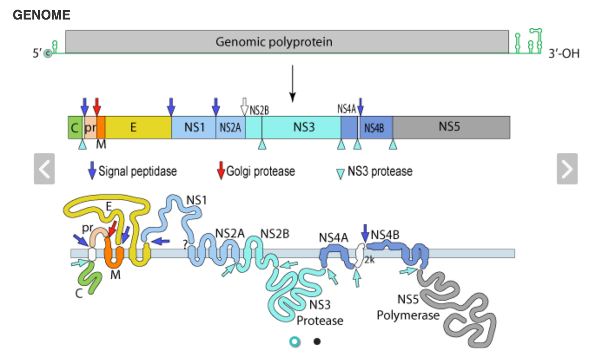
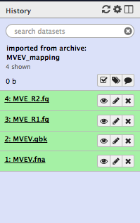
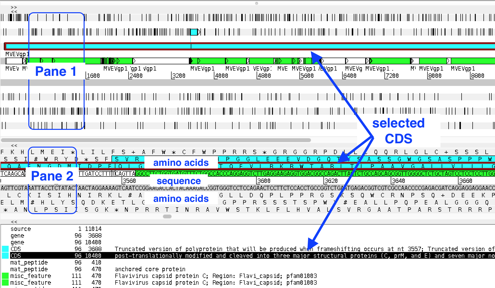
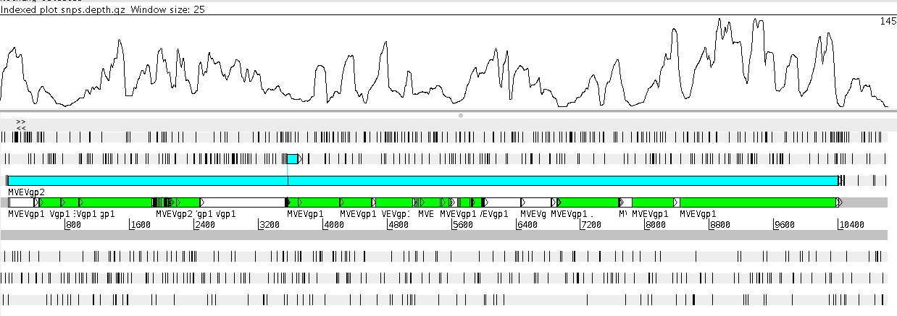
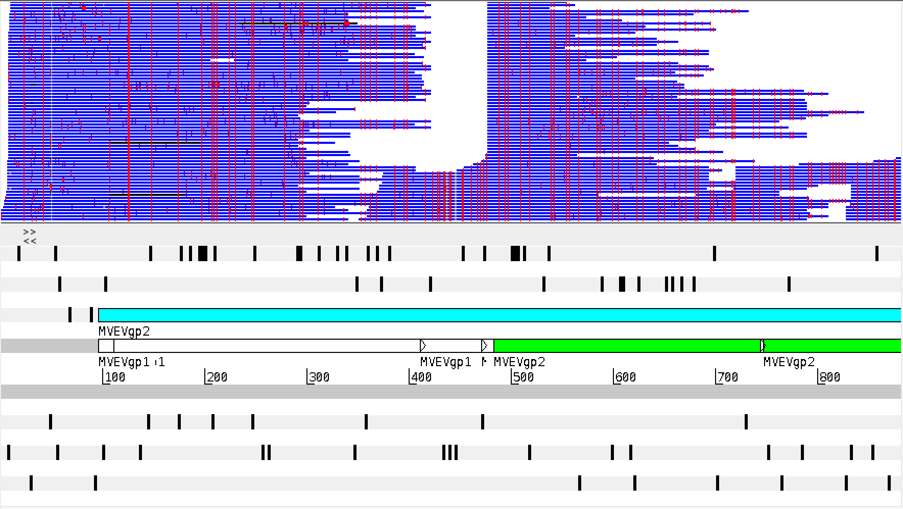

 
#Viral Genome Sequencing

This tutorial is about determining the genome sequence of a virus, using comparisons to a reference sequence.

##Background
Murray Valley encephalitis virus is classified as part of the Flavivirus genus of viruses, all of which are positive strand RNA viruses. The type species for this genus is yellow fever virus, and the genus includes dengue virus, west nile virus and zika virus.

Viruses from this genus have a single-segment genome of about 11 kb. Within this, there is a 10 kb open reading frame that encodes a polyprotein. Following translation, this protein is modified to yield the various, mature structural and non-structural viral proteins as illustrated in Fig. 1.

Fig. 1 - An overview of a typical flavivirus genome and the viral proteins that are part of the viral polyprotein (from [Viralzone](http://viralzone.expasy.org/all_by_species/24.html)).

There are 14 complete Murray Valley encephalitis virus genome sequences available at NCBI Viral Genomes.

- Go to NCBI [Viral Genomes](https://www.ncbi.nlm.nih.gov/genome/viruses/).
- Select <ss>Browse viral genomes by family</ss> and click on the family <ss>Flaviviridae</ss>: <ss>Complete Genomes</ss>
- Note: you may have to widen your screen to see all the columns of viral family names.

- Look at the row for Murray Valley encephelitis virus. In the Neigbours column, we can see there are 14.

<!--

: click on the 14 and then Entrez Nucleotide

This brings up a list of all the strains on NCBI.

following seq though is not in this list?
-->

In this tutorial we will use the prototype strain 1-151 as the reference genome sequence.

- This strain was isolated in the early 1950s - see [AF161266](https://www.ncbi.nlm.nih.gov/pubmed/10567642).

- [are we using this AF seq exactly? or if not, which seq]

- [This seq is not in the list of 14 --- does this mean it is just more distant and therefore didn't align closely?]

The isolate we are looking at has been sequenced using the Illumina platform.

- The genomic cDNA was prepared using random hexamers to prime the reverse transcription of the viral genomic RNA.
- After second strand synthesis, the cDNA was used to prepare an Illumina sequencing library and run on an Illumina MiSeq instrument.

In this activity we will use a read mapping approach to determine the sequence of a new Murray Valley encephalitis virus isolate.

##Import data

###Section overview:###

- Log in to your Galaxy server
- Import files required for the activity
- View imported files

###Go to the Galaxy Page###

- Web address: <http://phln.genome.edu.au/galaxy>
- [Remind me how to logon](https://docs.google.com/document/d/10meAZA7-OsD_PglLD2zL3m-EwkemFxVnRVUYGAmtOz4/pub)

###Import files to Galaxy###

- Click on the <ss>Analyze Data</ss> menu at the top of the page.
- Click on the <ss>History</ss> menu button (the  on the top right of the history pane)
- Click <ss>Import from File</ss> (at the bottom of the list)
- A new page will appear with a text box for the URL of the history to import.
- Copy the following URL into the text box:
- <fn>http://phln.genome.edu.au/public/dieter/Galaxy-History-MVEVmapping.tar.gz</fn>

- Click <ss>Submit</ss>
- Galaxy will download the data files from the internet and will be available as an additional history (takes about one minute).

###To make the newly imported history appear as the current history:###

- Click on the View all Histories button (the  on the top right of the history pane.)
- If the history has finished downloading it will appear with the title:
- <fn>“imported from archive: MVEVmapping“</fn>
- Click on the <ss>Switch to</ss> button above this history and then the <ss>Done</ss> button.

You should now have 4 files in the history pane as follows:

Reference sequence files [from AF161266?]:

- <fn>MVEV.gbk</fn> - genbank format
- <fn>MVEV.fna</fn> - fasta format

Illumina sequence reads (R1 and R2) from the new isolate:

- <fn>MVE_R1.fq</fn> - forward reads
- <fn>MVE_R2.fq</fn> - reverse reads

##Snippy

###Section overview:###

- Find variants in the isolate using the tool Snippy.

Snippy is a fast variant caller for haploid genomes. The software is available on GitHub at <https://github.com/tseemann/snippy>. For this activity, we are using Snippy as installed on Galaxy.

###Preliminary Activity###

- Run FastQC: How many reads in in each of the fastq files <fn>MVE_R1.fq</fn> and <fn>MVE_R2.fq</fn>?

- <fn>MVEV.fna</fn> and <fn>MVEV.gbk</fn> each contain the genome sequence of Murray Valley encephalitis virus strain 1-151 - how many bases in the genome? (Hint: use Fasta Statistics)

###Running Snippy###

Snippy maps reads from the new Murray Valley encephalitis virus isolate (the <fn>MVE_R1.fq</fn> and <fn>MVE_R2.fq</fn> reads) onto the genome sequence of Murray Valley encephalitis virus strain 1-151 (<fn>MVEV.fna</fn>). [or gbk? that's in the screenshot]

- Find Snippy in the tool menu (in  NGS: Variant Analysis)
- Select appropriate files (see screenshot below) and Execute (use default settings).

###Output###

Files cataloging SNP differences:

- 9: <fn>snippy on data 4, data 3, and data 2 snps vcf file</fn>
- 10: <fn>snippy on data 4, data 3, and data 2 snps gff file</fn>
- 11: <fn>snippy on data 4, data 3, and data 2 snps table</fn>
- 12: <fn>snippy on data 4, data 3, and data 2 snps summary</fn>

A log of the progress of the run:

- 13: <fn>snippy on data 4, data 3, and data 2 log file</fn>

Regions where reads aligned (NNNN ---, indicate regions where there was low or no read data):

- 14: <fn>snippy on data 4, data 3, and data 2 aligned fasta</fn>

A consensus genome sequence for the new isolate:

- 15: <fn>snippy on data 4, data 3, and data 2 consensus fasta</fn>

Summary of the read depth:

- 16: <fn>snippy on data 4, data 3, and data 2 mapping depth</fn>

A compressed version of the above files (and more that can be downloaded):

- 17: <fn>snippy on data 4, data 3, and data 2 out dir</fn>

Download these files to your local computer (click on the file name and then the disk icon in the lower left hand corner):

- 17: <fn>snippy on data 4, data 3, and data 2 out dir</fn> (and unzip)
- 2: <fn>MVEV.gbk</fn>
- 1: <fn>MVEV.fna</fn>

Also download these bam files from these URLs (open each URL in a new tab and the file should download automatically):

- <http://phln.genome.edu.au/public/dieter/snps.bam>
- <http://phln.genome.edu.au/public/dieter/snps.bam.bai>
- <http://phln.genome.edu.au/public/dieter/snps.depth.gz>
- <http://phln.genome.edu.au/public/dieter/snps.depth.gz.tbi>

Note: if you have previously downloaded these files, the new downloads may be renamed. Remove any spaces in the names.

[Should we explain why we have these four other files - where they are from, what they are needed for, etc - so if people are repeating this exercise on their own they can follow]

##Artemis

###Section overview:###

- View the reads from the new isolate mapped against the reference sequence, using the tool Artemis.

Artemis is a tool to view genome sequences and mapped reads, including variants (SNPs).

If Artemis is not installed, go to <http://www.sanger.ac.uk/science/tools/artemis>.

###View the reference sequence###

- Open Artemis.
- Go to <ss>File: Open</ss> and select <fn>MVEV.gbk</fn>. The file will probably have a "Galaxy" prefix, e.g. <fn>Galaxy2-[MVEV.gbk].genbank</fn>.

###The Artemis window:###

- panes 1 and 2 are the same, but can be scaled differently
- each pane has the double-stranded sequence in the centre, with amino acid translations above and below
- there is a third lower pane with feature information
- coding sequences are highlighted in blue
- other features are highlighted in green
- clicking on one of these will select it in all panels
- black vertical lines are stop codons (when zoomed out)
- move left and right with horizontal scroll bar
- zoom in and out with right-hand scroll bar

###Add a plot###

- Go to <ss>Graph: Add User Plot</ss>, select <fn>snps.depth.gz</fn>
-  A graph should display at the top of the screen
[is this depth of reads or depth of snps?]

The file that is used to produce the graph is a 3 column table (part of the file is shown below)

[what is the file name?]

                 …
Column 1: the name of the sequence, Column 2: the position in the sequence, Column 1: the read depth at that position

##Producing a draft genome sequence

###Section overview:###

- Produce draft genome sequence for the new viral isolate.

###Examine the mapped reads###
[or title]

What is the minimum read depth used by Snippy to call a SNP?

- Hint: Go back to Snippy on Galaxy - look at the information below the ‘Execute’ button

Would Snippy call a SNP at positions 1 → 5 ?

What is the maximum read depth?

What do we know about the sequence of the new isolate in the regions where there is low read coverage?

[close first Artemis window?]

- Unzip <fn>17: snippy on data 4, data 3, and data 2 out dir</fn>
- This makes an "out" folder containing some files including the consensus file.

- In Artemis, open <fn>snps.consensus.fa</fn>

This is a file that is based on the reference sequence and includes any confirmed SNPs called by Snippy.

 If we were going to use this sequence to produce the draft sequence of the new isolate, what bases would you have at positions 1→ 5?

###Getting an Overview of the Difference between strain 1-151 and our new isolate###

Simplest overview: view the bam file with Artemis

Open <fn>MVEV.gbk</fn> in Artemis and load the <fn>snps.bam</fn> via the File menu to “Read BAM / VCF”

Once loaded, differences between reads and the reference sequence can be highlighted by right/command click in the bam view window. Select ‘Show > SNP marks’.

###Getting more detail: looking at the table of SNPs###

Located in the out folder there is a html file that contains a table with information about each of the SNPs called by Snippy.

Included in the table is a column that provides a prediction about the impact each SNP will have on annotated protein coding regions. The genbank file provides the annotation information used by Snippy to make the predictions.

A total of 790 SNP differences were call by Snippy

Open snps.html in your web browser

[screenshot]

Summary: 663/790 SNPs do not result a difference in the encoded polyprotein

Is this pattern of variable genome sequence and more conserved protein sequence normal in viruses? What might be the cause?
