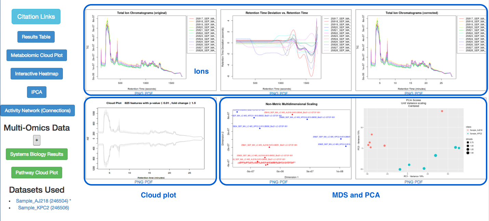
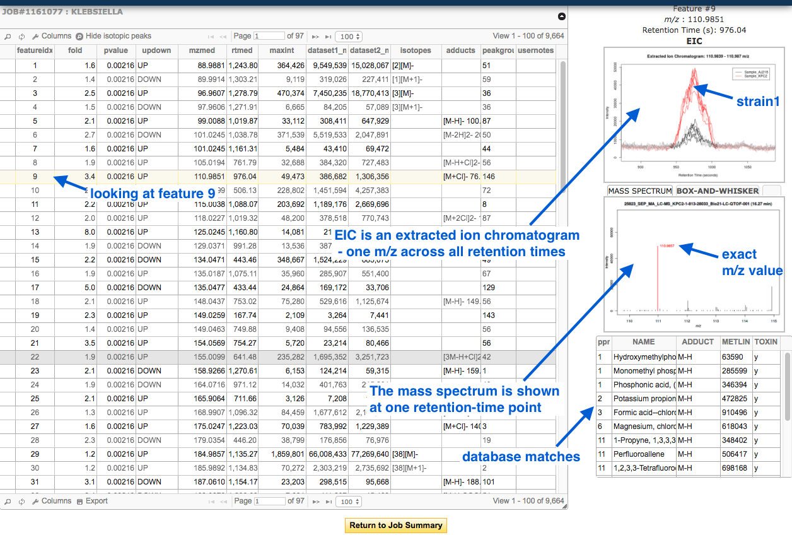
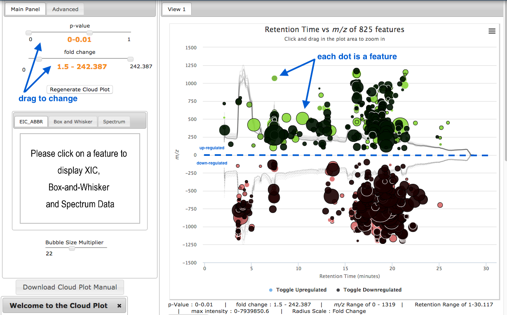
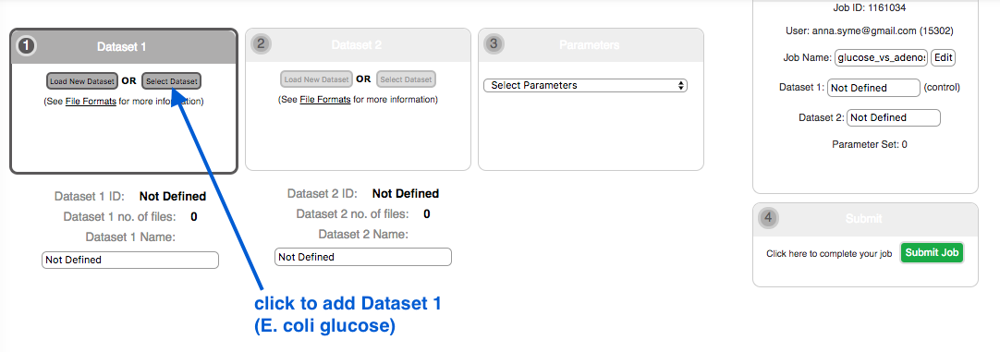
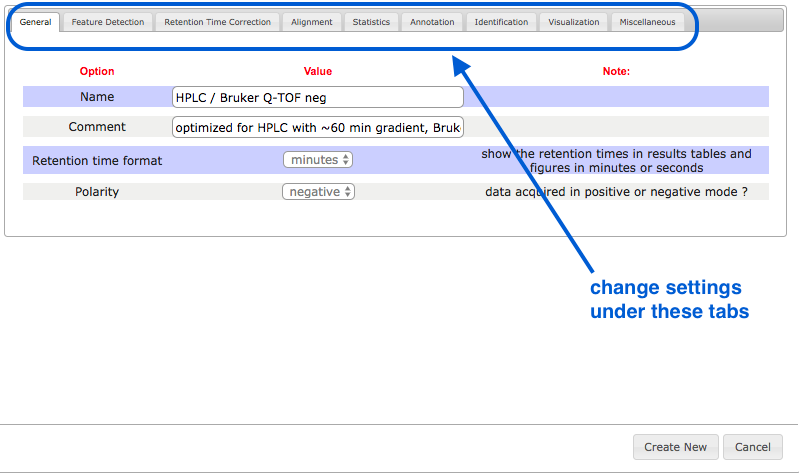

 
# Metabolomics with XCMS

## Overview

Metabolomics is the study of metabolites: small molecules (smaller than proteins) produced by organisms. One technique to identify and quantify metabolites is LC/MS (liquid chromatography-mass spectrometry).

In liquid chromatography, metabolites are sent through a column and are separated by various chemical properties.

- At each time point, the abundance of the particular group of metabolites is measured (the intensity).
- This is called a chromatogram:

*image: C Wenger, Wikipedia*

At each time point in this chromatogram, the group of metabolites is then ionized (charged) and fired through a mass spectrometer.

- These are separated based on their mass-to-charge ratio.
- This adds another dimension to the graph: an axis with the mass-to-charge ratio of the metabolites found at that time point, and their intensities.

*image: Daniel Norena-Caro, Wikipedia.*

There are multiple mass spectra. Each spectrum is often simplified into a graph of peaks only (local maxima):

*image: Wikipedia.*

- Each of these peaks is a "feature": an ion with a unique m/z and retention time.
- These masses can then be matched to a database to identify the metabolites.

<!-- To summarize:
one chromatogram - from the LC
multiple specta - from the MS
-->

A common aim is to compare metabolites between two samples (e.g. two different bacterial strains), and from there, to understand which biological pathways may be up- or down-regulated.

In this tutorial, we will use a platform called "XCMS online" to analyse metabolite data.

- Input: raw data from mass spectrometry
- Output: identified metabolites, and a comparison of their abundances between samples.

## XCMS

Go to: <https://xcmsonline.scripps.edu> and sign up.

## Get data

The data we will use today is from two bacterial strains of *Klebsiella pneumoniae*.

- strain AJ218 - 6 replicates
- strain KPC2 (antibiotic resistance) - 6 replicates

The raw data output from the mass spectrometer are points in a 3D graph: intensity, m/z, time (retention time).

Download these files to your local computer.

<!-- [if data release policy allows. upload to swift and put link here]. -->

Data format:

- We will use .mzML format. <!-- [this format is going to be uploaded to the Sepsis Data] -->

- The machine used to produced this data originally produced .d files. These have been converted into .mzML format using the Proteowizard MSConvert program.

To use Proteowizard: (Windows only)

- Download the program and open the MSConvert program.
- Browse. Add files.
- Change output format to .mzML
- Leave default settings.
- Click Start in the bottom right hand corner.

An alternative is the commercially-available Qualitative Analysis Software.

## Upload data

In the top panel, go to <ss>Stored Datasets</ss>. We will upload some data here.

- Drag the <fn>.mzML</fn> files into the <ss>Drop Here</ss> box - 6 replicates for each strain.

- Wait until all files have a green tick (scroll down to check all).
- Name the datset (e.g. Sample AJ218 or Sample KPC2) and click <ss>Save</ss>.
- Click <ss>Save Dataset & Proceed</ss>.

Repeat with the second strain.

## Set up job

In the top panel, click on <ss>Create Job</ss> and select <ss>Pairwise Job</ss>.

On the right hand side, under Job Summary, Job Name: click <ss>Edit</ss>, enter job name: e.g. Klebsiella, and then click <ss>Save</ss>.

Under <ss>Dataset 1</ss> click on <ss>Select Dataset</ss>.

- Choose AJ218.

Under <ss>Dataset 2</ss> click on <ss>Select Dataset</ss>.

- Choose KPC2.

We now need to set parameters that correspond with the machine on which the data was generated. In a typical analysis, we would look at the raw output files and examine the chromatograms and mass spectra to inform some of the settings. Here we have chosen appropriate settings for this data set.

<!-- e.g. use SeeMS (part of proteowizard) to examine raw data

- internal standard - a known molecule added
- e.g. a labelled standard (lablled with C13 etc)
- use the expected and actual mass of labelled standard to calculate the appropriate error setting (ppm - setting )
-->

Under <ss>Parameters</ss> select HPLC / UHD Q-TOF (HILIC, neg. mode).

- Click <ss>View/Edit</ss>.
- This brings up a window to change some settings.

<!---  Note: even if you use an existing setup, some values will need to be re-set - e.g. Statistical test, View pairs (I set up as 1 matches 1 etc?); also biosource will need to be re-set. -->

### General

- First, click <ss>Create New</ss> in the bottom right hand corner.
- Give it a name. e.g. Agilent 6545
- (Don't click Save Current yet).
- <ss>Retention time format</ss>: seconds
- <ss>Polarity</ss>: negative

See the tabs along the top: we will change some of these settings.

### Feature Detection

This is to adjust for noise in the centroid data.

- <ss>Method</ss>: centWave
- <ss>ppm</ss>: 50
- <ss>minimum peak width</ss>: 10
- <ss>maximum peak width</ss>: 50

### Retention time correction
This is to correct the shift that occurs as the run progresses.

- <ss>Method</ss>: obiwarp
- <ss>profStep</ss>: 0.1

### Alignment

This is to align spectra after retention time correction.

- <ss>mzwid</ss>: 0.5
- <ss>minfrac</ss>: 0.5
- <ss>bw</ss>: 20

### Statistics

Set up the statistical test for the metabolites from two strains.

- <ss>Statistical</ss> test: Unpaired non-parametric (Mann-Whitney)

### Annotation

- <ss>Search for</ss>: isotopes + adducts
- <ss>m/z absolute error</ss>: 0.05
- <ss>ppm</ss>: 50

<!-- can have diff adducts (eg NH44), helps with ID; the adducts depend on the solvent used in LC-->

### Identification

- <ss>ppm</ss>: 50
- <ss>adducts</ss>: [M-H]-
- <ss>sample biosource</ss>: Select biosource. Search: K pneumo. <ss>Select</ss> the top strain.
- <ss>pathway ppm deviation</ss>: 5

### Visualization

- <ss>EIC width</ss>: 200

### Miscellaneous

- <ss>Bypass file sanity check</ss>: tick

### Next

- <ss>Save Current</ss>
- <ss>Submit Job</ss>

This will now bring up the "View Results" page.

- The current job will be listed as "Processing" with a % completion bar.
- The time taken will depend on server load.

## View results

Click on <ss>View</ss>.

There are six graphs, and options for other results in the left hand panel.

### Ions detected

Look at the top three graphs.

- Graph 1: Total ion Chromatograms (original):

    - All the ions detected. Their intensity vs retention time.

- Graph 2: Retention Time Deviation vs. Retention Time:

    - A graph showing the correction curve.

- Graph 3: Total ion Chromatograms (corrected):

    - A corrected version of graph 1.

### Sample information

- Graphs 5 and 6 show MDS (Multi-dimensional Scaling) and PCA (Principal Components Analysis) results.

    - Are the samples separated well?
    - Samples (or conditions) should be separated into two groups.
    - For a more detailed examination, click on "iPCA" in the left hand panel.

### Results Table

Click on the Results Table in the left hand panel. This is a table of "features" - a feature is an ion with unique m/z and retention time.

<!-- The table headings mean:

- **fold**: fold change (log?). ratio of mean intensities.
- **p-value**: for whatever test was performed?
- no q value (or is this an option to toggle p value?)
- **updown**: up or down regulated (compared to the other sample)
- **mzmed**: median value for m/z
- **rtmed**: median value for retention time
- **maxint**: max intensity of the feature
- **dataset1_mean**: average intensity of this feature in dataset1
- **isotopes**: isotopes found (why not all have at least one? )
- **adducts**: ? other things that formed?
- **peakgroup**: abritrary number for different groups?  where from?
- no Metlin column?  only have as a graph to the right?
-->

- Click on a row (a feature) to display associated graphs in the right-hand panel.

- The [METLIN database](https://metlin.scripps.edu/landing_page.php?pgcontent=mainPage) contains data on metabolites, their mass, and their known and predicted fragment masses.

To filter the table, click on the small magnifying glass:

- Filter by p-value or fold change (or both).
- e.g. p-value less or equal to 0.01, fold change greater than 30
- Investigate these features and the identified matches in the Metlin database.

<!-- this table can be exported into other statistical packages -->

### Cloud plot

In the results pane on the left, click on Metabolomic Cloud Plot.

- A cloud plot shows the features (m/z and retention time) as dots/circles.
- The size of the circles is relative to their fold change.
- Features are shown as either up- or down-regulated, by their position above or below the 0-axis.
- Adjust p-value and fold change, and click <ss>Regenerate Cloud Plot</ss>.
- Click on a feature to see its associated graphs in the left hand panel.

### Activity network

This shows the pathways that correspond to the identified metabolites. The table under the image shows the "Top pathways" - these are ordered by their p-values.

<!-- Next :More complex analyses: eg compare wildtype with 5 mutants. Metabolites in common to the 5 mutants identified; then investigate biochemical pathway and function.
-->

## Links

[XCMS Online](https://xcmsonline.scripps.edu)

[XCMS Documentation](https://xcmsonline.scripps.edu/landing_page.php?pgcontent=documentation)

Tautenhahn, R. et al. (2012) XCMS Online: A Web-Based Platform to Process Untargeted Metabolomic Data. *Analytical Chemistry*. DOI: 10.1021/ac300698c

Smith, R. et al. (2014) Proteomics, lipidomics, metabolomics: a mass spectrometry tutorial from a computer scientist's point of view. *BMC Bioinformatics*. DOI: 10.1186/1471-2105-15-S7-S9. *See Figure 2 for an excellent explanation of the various graphs produced from MS.*

Patti, G. J. et al. (2013) A View from Above: Cloud Plots to Visualize Global Metabolomic Data. *Analytical Chemistry*. DOI: 10.1021/ac3029745

<!--

## Optional: repeat with different data

- Add each set of replicates as a single dataset.
- Here, we will add replicates for *E. coli* in two conditions: glucose and adenosine.
- (This data is a subset from XCMS Public, ID 1133019, Huan et al.)
- In the top right corner, click on <ss>Add Dataset(s)</ss>.

- In the top right corner, click on <ss>Add File(s)</ss>.
- Browse for the files and add them. Here we will add Glu_1_1.mzData, Glu_1_2.mzData, Glu_1_3.mzData.
- Wait until all files have a green tick (scroll down to check all).
- Name the dataset (e.g. Ecoli_glucose) and click <ss>Save</ss>.
- Click <ss>Save Dataset & Proceed</ss>.
- Repeat for the three replicates in the other condition (adenosine).
- You should now have two stored datasets, with three files in each.

### Set up job

In the top panel, click on <ss>Create Job</ss> and select <ss>Pairwise Job</ss>.

On the right hand side, under Job Summary, Job Name: click <ss>Edit</ss>, enter job name: e.g. E_coli and then click <ss>Save</ss>.

Under <ss>Dataset 1</ss> click on <ss>Select Dataset</ss>.

- Choose Ecoli_glucose.

Under <ss>Dataset 2</ss> click on <ss>Select Dataset</ss>.

- Choose Ecoli_adenosine.

We now need to set parameters that correspond with the machine on which the data was generated. In a typical analysis, we would look at the raw output files and examine the chromatograms and mass spectra to inform some of the settings. Here we have chosen appropriate settings for this data set.

- Under <ss>Parameters</ss> select HPLC / Bruker Q-TOF neg.

- Click <ss>View/Edit</ss>

This brings up a window to change some settings, under the tabs in the top bar.

### General

- First, click <ss>Create New</ss> in the bottom right hand corner.
- Give it a name that refers to the instrument. e.g. Bruker-customized
- (Don't click <ss>Save Current</ss> yet).
- Click on the tabs in the top bar to change other settings.

### Feature Detection

This is to adjust for noise in the centroid data.

- <ss>Method</ss>: centWave
- ppm: 10
- minimum peak width: 10
- maximum peak width: 60

### Retention time correction

This is to correct the shift that occurs as the run progresses.

- <ss>Method</ss>: obiwarp
- profStep: 1

### Alignment

This is to align spectra after retention time correction.

- mzwid: 0.015
- minfrac: 0.5
- bw: 5

### Statistics

Set up the statistical test for the metabolites from two conditions.

- Statistical test: Unpaired parametric t-test (Welch t-test)

### Annotation

- Search for: isotopes + adducts
- m/z absolute error: 0.015
- ppm: 5

### Identification

- ppm: 10
- adducts: [M-H]-  and [M+Cl]-

note -- should have added M-H20-H, M+Na-2H and M+Cl also

- Sample biosource: <ss>Select</ss> Ecoli
- ppm: 5

### Visualization

- EIC width: 200

### Miscellaneous

- Bypass file sanity check: tick

- <ss>Save Current</ss>
- <ss>Submit Job</ss>

This will now bring up the "View Results" page.

- The current job will be listed as "Processing" with a % completion bar.
- The time taken will depend on server load.

--->
