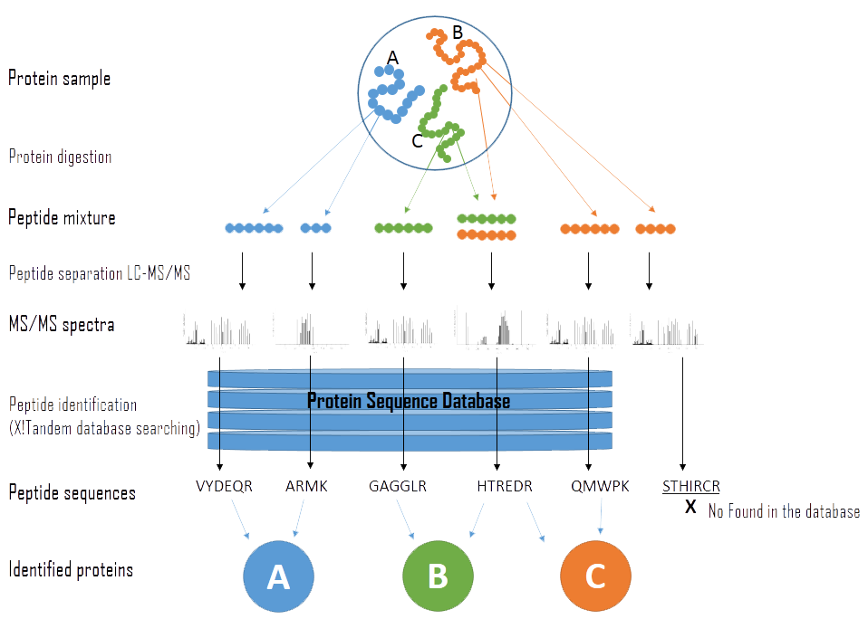
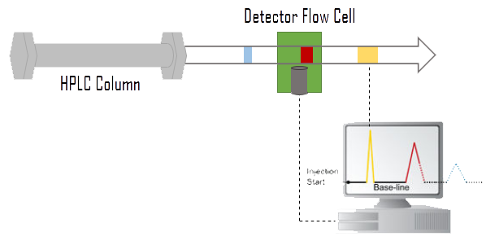
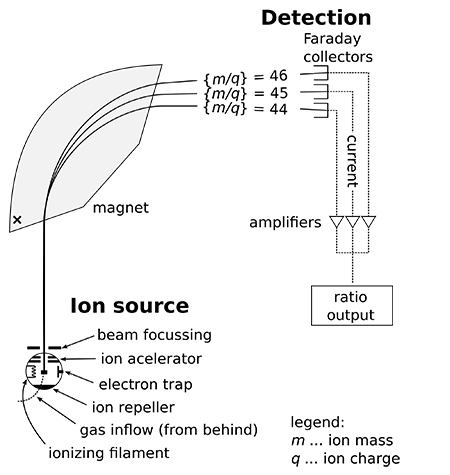
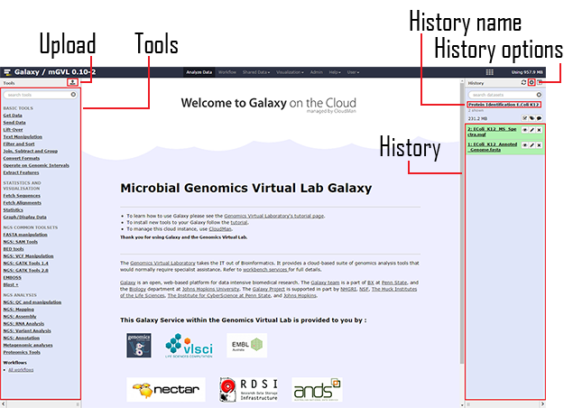
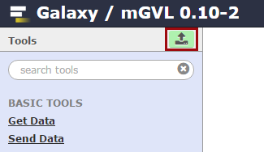
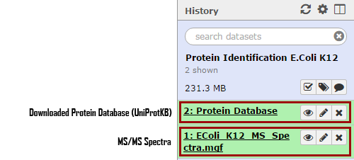
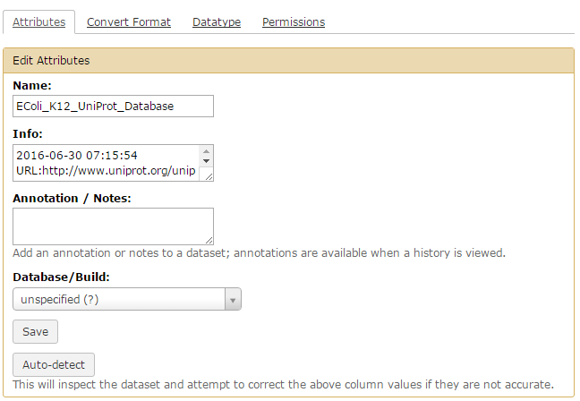
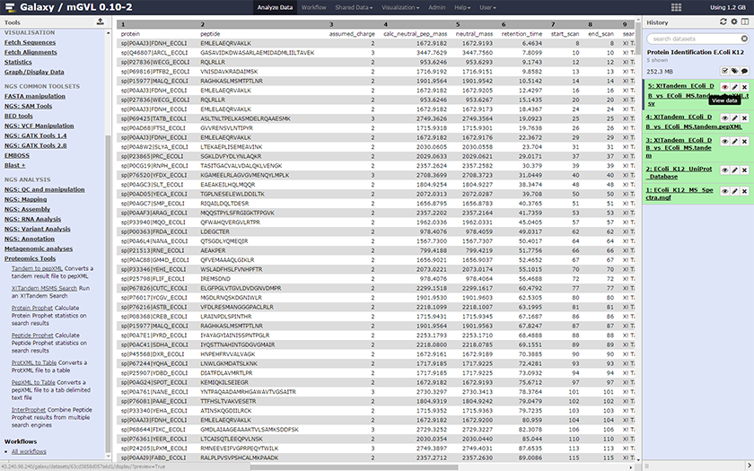

Protein indentification using X!Tandem
==================================

Introduction
------------
The high-throughput nature of proteomics mass spectrometry is enabled by a productive combination of data acquisition protocols and the computational tools used to interpret the resulting spectra (list of peaks). One of the key components in mainstream protocols is the generation of tandem mass (MS/MS) spectra by peptide fragmentation. This approach is currently used in the large majority of proteomics experiments to routinely identify hundreds to thousands of proteins from single mass spectrometry runs. In order to do that multiple tools have to be employed: **LC-MS/MS** to segregate components of proteomic samples associated with *protein identification* (see **Figure 1**) softwares, **X!Tandem**[^xtand], **Mascot** or **SEQUEST** all of which perform protein identification but with different algorithms.

> **Figure 1** --- *General overview of the experimental steps and flow of data in protein identification using shotgun proteomics experiment.*[^figure1]. 

**Figure 1** shows a general overview of the experimental steps in protein identification. Sample proteins are first cleaved into peptides, which are then separated using chromatography (e.g. HPLC). The peptides are then ionised and then selected ions are fragmented to produce signature tandem mass spectrometry (MS/MS) spectra. Peptides are identified from the MS/MS spectra by using programs such as X!Tandem, which search against a database of known peptides. Sequences of the identified peptides are used to infer which proteins are present in the original sample.

## Background

### LC-MS/MS Analysis

**Liquid Chromatography** (LC) is a technique used to separate molecules in the solvent (mobile phase). Nowadays liquid chromatography utilising high pressure to force the solvent through the columns packed with porous particles (stationary phase) is referred as High Pressure Liquid Chromatography (HPLC) -- see **Figure 2**. After purifying the proteomic cell content, LC is able to separate the different proteins which are injected in the mass spectrometer. Each peak from the results will be analysed by mass spectrometry.

> **Figure 2** --- *Schema of High Pressure Liquid Chromatography (HPLC)[^figure3].* Compounds of the mixture are separated in the HPLC column according to various parameters (polarity, charge, affinity etc). The type of separation depends on the column being used). A detector flow cell is used to detect the separated compounds band.

**Mass spectrometry** (MS) -- see **Figure 3** -- has been widely used to analyse biological samples and has evolved into an indispensable tool for proteomics research. Fundamentally, MS measures the mass-to-charge ratio (m/z) of gas-phase ions. Mass spectrometers consist of an ion source that converts analyte molecules into gas-phase ions, a mass analyser that separates ionised analytes on the basis of m/z ratio and a detector that records the number of ions at each m/z value. 

> **Figure 3** --- *Schema of mass specter*. "A mass spectrometer consists of three components: an ion source, a mass analyzer, and a detector. The ionizer converts a portion of the sample into ions. There is a wide variety of ionization techniques, depending on the phase (solid, liquid, gas) of the sample and the efficiency of various ionization mechanisms for the unknown species. An extraction system removes ions from the sample, which are then targeted through the mass analyzer and onto the detector. The differences in masses of the fragments allows the mass analyzer to sort the ions by their mass-to-charge ratio. The detector measures the value of an indicator quantity and thus provides data for calculating the abundances of each ion present." [^figure4]

**Tandem mass spectrometry** (MS/MS) -- see **Figure 4** -- is a key technique for protein or peptide sequencing and post-translational modifications analysis. Collision-induced dissociation (CID) has been the most widely used MS/MS technique in proteomics research. In this method, gas-phase peptide/protein cations are internally heated by multiple collisions with rare gas atoms. The result is fragmented ions that, after the detection phase and reconstitution, reveal the amino-acid chains. 

> **Figure 4** --- *Schema of a tandem mass spectrometry associated with liquid chromatography (LC-MS/MS)*. This technique combine separation form liquid chromatography and m/z ratio analyse of the tandem mass spectrometry in order to generate spectra.

**File formats** : During a full proteomics analysis, as seen in **Figure 5**, many files are created. Every step has it's own multiples files formats :

> **Figure 5** --- *Multiple formats during MS treatment*[^MS file format]. From the sample processing to the final file, various file formats can be used. This schema shows the different processes and file formats that are generated during a full MS experiment.

For this tutorial we will focus on the "Informatics Analysis" part using the following file formats:

* **fasta**: fasta files are mainly used for representing either nucleotide sequences or peptide sequences, using single-letter codes.
* **MGF** : Mascot Generic Format (MGF) file is the most common format for MS/MS data encoding in the form of a peak list[^MGF]. This file encodes multiple MS/MS spectra in a single file listing the [m/z, intensity] pairs separated by headers -- see **Figure 6**. More precisely each query represents a complete MS/MS spectrum delimited by BEGIN IONS and END IONS statements. Embedded parameters[^embedded_parameters] can be found after each BEGIN IONS statement. An example entry is shown in the figure below:

> **Figure 6** --- *Sample of a MGF file*. MGF files are used for enconding MS results, multiple spectra can be enconded in one MGF. Every spectrum begins with the *BEGINS IONS* assessment and finishes with *END IONS*. MGF files can be divided in 2 parts : 
	-- The header : containing information about the embedded Search Parameters. 
	-- Ions information : the first figure is the ion mass, the second is the ion charge.

### X!Tandem

**X!Tandem** is an open source software that can match tandem mass spectra (usually the experiment) with peptide sequences from a database. This process allows identification of proteins in one or more samples.

The X!Tandem search engine calculates a statistical confidence (expectation value) for all of the individual spectrum-to-sequence assignments. Some spectra might map to more than one protein, in this case X!Tandem will pick the best match with the highest confidence score (see **Figure 7**). The output is a lists all of the high confidence assignments.

> **Figure 7** --- *Schema of the X!Tandem analysis*[^figure1]. After LC-MS/MS analysis the experimental spectrum is compared to a theoretical spectrum made from a protein database. This comparison leads to a list of peptide match ranked by score.

### GALAXY

GALAXY[^galaxy] is an open source, web-based platform for biomedical research. GALAXY allows users to perform multi-omics data analyses: genomics, proteomics, transcriptomics and more. Numerous tools are available to achieve various analyses. This tutorial will focus on proteomics identification: matching the experimental data, spectra from LC-MS/MS analysis against data from a protein database using X!Tandem.

Before starting, a quick overview of the GALAXY interface -- see **Figure 8**. The interface is divided into three parts:

* **Left panel**:  List the tools that are available.  A search textbox is at the top of the panel in order to find the tool you want.
* **Right panel**: Is the history of all the data outputs from previous steps and subsequently becoming the input for the next step. For example, the figure below shows the data imported ready for the next step. This panel allows the user to follow the different steps of the  analysis.
* **Central panel**: Is the main screen, showing the details and options of the selected tool.

> **Figure 8** --- *Galaxy interface*. Divided in 3 parts Galaxy's interface go from the left selecting the tools to the right where the results are displayed.

---

Tutorial
--------
This tutorial describes how to identify a list of proteins from tandem mass spectrometry data.

Analyses of this type are a fundamental part of most proteomics studies. The basic idea is to match tandem MS spectra obtained from a sample with equivalent theoretical spectra against a reference protein database. The process is referred to as "protein identification", although amino acid sequences are not obtained *de novo* with this method.

### Objectives

The objective of this tutorial is to perform protein identification from MS/MS spectra data using the X!Tandem tool in GALAXY -- see **Figure 9**. The basic steps involved are:

* Loading UniProt[^uniprot] proteome data in GALAXY (fasta file format)
* Loading your MS/MS spectra in GALAXY
* Run X!Tandem proteomics search
* Sorting and analysing the results

The tutorial will finish with an exercise where you repeat the same protocol **but** with your own proteome as the reference database instead of using UniProt.

> **Figure 9** - *General flowchart of this training*. The first part is to upload datasets to be investigated. Then the training will cover the key parts of the configuration of a X!Tandem search. Finally, we look at sorting and analysing the results.

The aim of the training will be to create a list of all proteins that can be confidently said to be present in the sample.

This tutorial uses the following open source tools:

* X!Tandem search engine
* Trans Proteomic Pipeline[^tpp]
* GALAXY platform with tools already installed

This tutorial uses an *E. Coli* MS/MS spectra dataset that can be downloaded from: [EColi K12 Dataset](images/)

Original source : [http://www.marcottelab.org/MSdata/](http://www.marcottelab.org/MSdata/)

###STEP 1: Data import

* Before importing data, <ss>Name</ss> your history. <ss>Click</ss> on the "Unnamed history" on the top of the right panel until you get the cursor. <ss>Delete</ss> and <ss>type</ss> in "Protein Identificaiton E.coli K12" or a more meaningful name. You **must** <ss>hit Enter</ss>, otherwise the name will not be saved.

* Next, <ss>import</ss> data into GALAXY. On the left panel <ss>click</ss> on the upload button as shown below:
 

* A new window will open, where you can select a method to upload your data: Choose local file, Choose FTP file, Paste/Fetch data. <ss>Click</ss> on <ss>Paste/Fetch data</ss> then copy and paste the URL of the mass spectrometer file: into the textbox: EColi_K12_MS_Spectra.mgf

> **Tip** : You can also use the <ss>Get Data &rarr; Upload file</ss> tool to obtain the same result. Here you want to upload your MS/MS spectra.

 
> **Warning** : X!Tandem only accepts mgf files in GALAXY.  Other file formats have to be converted beforehand. A useful tool for that is msconvert[^msconvert](download : [here](http://proteowizard.sourceforge.net/downloads.shtml). This tool only working on Windows).

### STEP 2: Import Reference Data

We will first use the UniProt Database as our reference data to search against.

* Select the tool named <ss>Protein Database Downloader</ss>
* Choose the database: <fn>UniProtKB</fn>
* Select the organism of interest: <fn>Escherichia Coli (strain K12)</fn>
* Click on <ss>Execute</ss>

* You will see your history update with the new data imports

* Rename your "Protein Database" by clicking on <i class="icon-pencil"></i> icon.
* Select <ss>Edit Attributes</ss>
* In **Name**, type in <fn>EColi_K12_UniProt_Database</fn>
* Click <ss>Save</ss>

###STEP 3: X!Tandem MS/MS Search

This part of the tutorial is to perform the X!Tandem MS/MS search. 

* The tool can be found in the left panel under the section <ss>Proteomics Tools &rarr; X!Tandem MSMS Search</ss>
* In the central section, you should see the following options. Below the key parameters are explained in detail. 

X!Tandem proposes many options, the key options of interest are:

1. **Uploaded FASTA file**: this parameter is to select the fasta file that will be used as the proteins database.
2. **MSMS File** : select the spectra file to analyse.
3. **Variable Modifications**: this option considers possible modification on each residue (which impact the MS/MS spectra).
4. **Fixed Modifications**: this option allows you to specify any known modification.
5. **Missed Cleavages Allowed**: "when a cleavage reagent (either chemical or enzymatic) is used to cleave the peptide backbone of a protein to produce peptides, different sites along the backbone will have different reaction rates and kinetics. Therefore, there may be some sites that should be cleaved by the reagent that are not completely cleaved during the course of the experiment. The value of this parameter represents the maximum number of missed cleavage sites allowed within a peptide."
6. **Enzyme**: specify the enzyme that has been used to cleave the proteins (affecting the interpretation of the spectrum).
7. **Fragment ion tolerance**: define the minimum weight (in Da) of the fragmented ions, default value is 0.5.
8. **Precursor ion tolerance**: define the minimum weight (in Da) of the precursor ions.

In this tutorial, we are using the following parameters:

| Parameters Name       | Value          | Default Value |
| :------------- | -------------|-------------:| 
| Uploaded FASTA file     | EColi_K12_UniProt_Database | -- |
| MSMS File    | EColi_K12_MS_Spectra.mgf     |  -- |
| Variable Modifications | Oxidation M      | -- |
| Fixed Modifications | Carbamidomethyl C      | -- |
| Missed Cleavages Allowed | 2      | 2|
| Enzyme| 	Trypsin     | Trypsin |
| Fragment ion tolerance | 0.5      | 0.5 |
| Precursor ion tolerance | 10 ppm      |  10 ppm |

* Leave all other parameters as their default settings.
* Click on <ss>Execute</ss>

* The history should update with a new entry, the output file of the X!Tandem
* Rename the output by clicking on the <i class="icon-pencil"></i>  icon

* You can view the output by click on the name in the history panel.

###STEP 4: Convert X!Tandem XML to Table 

The output of X!Tandem is an XML format, which is not easy to decipher. In order to get a more readable file, we will convert the XML format to a table. This is a two step process:

* Select <ss>Proteomics Tools &rarr; Tandem to pepXML</ss>
* Select your *tandem* file in the <fn>Input File</fn> field
* Click on <ss>Execute</ss>
* The history should update with a new *pepXML* file. The pepXML file is still a XML file and needs to be converted to a tabular.
* Select <ss>Proteomics Tools &rarr; PepXML to Table</ss>
* Select your *pepXML* file in the <fn>Input File</fn> field
* This history should update with a new file

After the X!Tandem search we obtain a list of proteins present in the sample data from Step 1:

| Tabular name      | Tandem file XML designation        | Definition |
| :------------- | -------------|  -------------:|
| Protein     |label |  Protein name according to the database used for the MS/MS search|  
| Peptide    | seq     |   Peptide sequence  |
| Assumed_charge | z      | Parent ion mass (plus a proton) from the spectrum |
| Calc_neutral_pep_mass | mh (+mass of a proton)      | Parent ion mass calculated from the spectrum|
| Neutral_mass | mh (+mass of a proton)      | Calculated peptide mass (plus a proton)|
| Retention_time | 	rt     |  Length of time between injection and position of the target compound peak.[^rt]|
| Start_scan | id     |  id of the group treated (where the analysis starts)|
| End_scan | id      |id of the domain treated (usually the same as start_scan, no consideration of the doted name in the original XML file)|
| Search_engine | *---* | Name of the search engine used, in our case X!Tandem (associated with the scoring method : *k-score*)|
| Raw_score | expect |Expectation value for the top ranked protein identified with this spectrum |

> **Note:** You can find all the details on the X!Tandem output file here: [The file format for X! series search engines](http://www.thegpm.org/docs/X_series_output_form.pdf). The tandem XML file contains more information than the tabular format which can also be of further use (e.i. the score for the different ions *x, y, z, a, b, c* ...)

### Exercise
> Repeat the tutorial but instead of uploading a UniProt database in Step 2, upload your own database. You can use the *E. Coli* dataset : [E. Coli Annotated Genome](images/EColi_K12_Annoted_Genome.fasta) and compare the two outputs.

---

##References

[^xtand]: X!Tandem website: http://www.thegpm.org/tandem/. X!Tandem documentation : http://www.thegpm.org/TANDEM/api/. Craig, R., and R. C. Beavis. 2004. *“TANDEM: matching proteins with tandem mass spectra.”* Bioinformatics 20, no. 9 (June): 1466-67. http://dx.doi.org/10.1093/bioinformatics/bth092.

[^figure1]: Nesvizhskii, Alexey I. *"Protein Identification By Tandem Mass Spectrometry And Sequence Database Searching"*. Mass Spectrometry Data Analysis in Proteomics 87-120. 
 --- [Mass Spectrometry Data Analysis in Proteomics](http://www.springerprotocols.com/BookToc/doi/10.1385/1597452750)

[^galaxy]: GALAXY platform : https://usegalaxy.org/. You can also find a more extensive documentation here : https://galaxyproject.org/.
Afgan, Enis et al. *"The Galaxy Platform For Accessible, Reproducible And Collaborative Biomedical Analyses: 2016 Update"*. Nucleic Acids Res 44.W1 (2016): W3-W10.
 --- [The Galaxy platform for accessible, reproducible and collaborative biomedical analyses: 2016 update](http://www.ncbi.nlm.nih.gov/pubmed/27137889)

[^uniprot]: UniProt : http://www.uniprot.org/. Apweiler, R. *"Uniprot: The Universal Protein Knowledgebase"*. Nucleic Acids Research 32.90001 (2004): 115D-119.
 --- [UniProt: the Universal Protein knowledgebase](http://www.ncbi.nlm.nih.gov/pubmed/14681372)

[^figure3]: High-performance liquid chromatography (HPLC): [How Does High Performance Liquid Chromatography Work ?](http://www.waters.com/waters/en_AU/How-Does-High-Performance-Liquid-Chromatography-Work%3F/nav.htm?cid=10049055&locale=en_AU) Mant, Colin T. et al. *"HPLC Analysis And Purification Of Peptides"*. Peptide Characterization and Application Protocols (2007): 3-55.

[^figure4]: Aebersold, Ruedi and Matthias Mann. *"Mass Spectrometry-Based Proteomics"*. Nature 422.6928 (2003): 198-207.
 --- [Mass Spectrometry-Based Proteomics](http://www.ncbi.nlm.nih.gov/pubmed/12634793)

[^MS file format]: Deutsch, E. W. *"File Formats Commonly Used In Mass Spectrometry Proteomics"*. Molecular & Cellular Proteomics 11.12 (2012): 1612-1621.
 --- [File Formats Commonly Used in Mass Spectrometry Proteomics](http://www.ncbi.nlm.nih.gov/pmc/articles/PMC3518119/)

[^MGF]: Mascot Generic Format (MGF) file is likely the most common text format for MS/MS data encoding in the form of a peak list. This file encodes multiple MS/MS spectra in a single file via m/z, intensity pairs separated by headers.
 --- [MGF file format](http://www.matrixscience.com/help/data_file_help.html)

[^embedded_parameters]: The MGF format allows parameters that can be found after the BEGIN IONS statement.
 --- [Embedded Parameters](http://www.matrixscience.com/help/data_file_help.html#PARAMS)

[^rt]: The retention time of a peak can be used as means of qualitative identification. The length of time between injection and position of the target compound peak.
 --- [Retention Time Parameters](http://www.shimadzu.com/an/retentiontime_parameters.html)
 --- [Retention Time explained for GC/MS](http://www.scientific.org/tutorials/articles/gcms.html)

[^tpp]: The Trans-Proteomic Pipeline (TPP) website : http://tools.proteomecenter.org/wiki/index.php?title=Software:TPP. Deutsch, Eric W. et al. *"A Guided Tour Of The Trans-Proteomic Pipeline"*. Proteomics 10.6 (2010): 1150-1159.
 --- [A Guided Tour of the Trans-Proteomic Pipeline](http://www.ncbi.nlm.nih.gov/pmc/articles/PMC3017125/)

[^msconvert]: ProteoWizard Tools website : http://proteowizard.sourceforge.net/tools.shtml. Holman, Jerry D., David L. Tabb, and Parag Mallick. *"Employing Proteowizard To Convert Raw Mass Spectrometry Data"*. Current Protocols in Bioinformatics (2014): 13.24.1-13.24.9.
--- [Employing ProteoWizard to Convert Raw Mass Spectrometry Data](http://www.ncbi.nlm.nih.gov/pmc/articles/PMC4113728/)